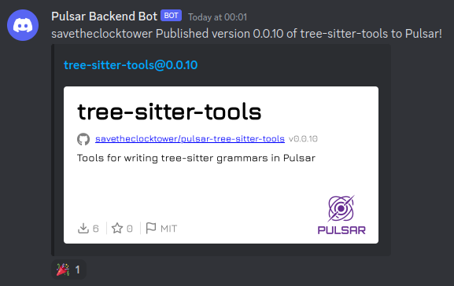

Is it a bird? Is it a plane? No it's the May community update!

<!-- more -->

# Welcome to the May Community Update

Hello again and a warm welcome to our May community update! In store for you this time are Pulsar iconography updates, `symbols-view` improvements, CI upgrades and bunch of upgrades to our package backend and website.

Just want to first mention that we have a [new survey](https://docs.google.com/forms/d/e/1FAIpQLSfnEEAQHUJbRVcH2NlNvLxmK0ZUcb5xuOCt1pYOGytvne0kJw/viewform?usp=sf_link) up, we would like some feedback from our community on a few aspects of the project so if you haven't answered this already then please have a look, every response is useful to us and we greatly appreciated.

Now without further waffling, onto the updates!

## Octicons iconography update

So this is a change we [have in the works](https://github.com/pulsar-edit/pulsar/pull/509) thanks to [@confused-techie], to upgrade Pulsar's iconography by updating the version of [Octicons](https://primer.style/octicons/). The version being used currently in Pulsar is _really_ old (v4.4.0 - from 2016!) and there have been many, many updates since then with a whole bunch of new icons and improvements (now on version v18.3.0).

You can see examples of the new Octicons in the below image:


One of the initial problems to work around was that Octicons no longer ships with font files, only the svg images. This meant that in order to use them they first had to be created as a font. This also meant modifying the font to make sure that the various codes aligned with the old ones so that they could, where possible, be a drop in replacement for the old version without breaking the naming scheme from upstream Octicons for use as reference material.


We have a couple of different goals here. The main one is simply to give more options to ourselves and users in terms of icon variation so that we can make better choices for icon usage. We would of course retain the `4.4.0` set (just as `2.1.2` has also been retained).

One of our others is a plan to hopefully modernise the UI, for example we have a bunch of new icons we can use for extending the set of file icons. You can see a couple of potential implementations in the below picture compared to the original. We actually have a survey up right now to gauge the community response to this so if you haven't already then please consider giving us [your opinion](https://docs.google.com/forms/d/e/1FAIpQLSfnEEAQHUJbRVcH2NlNvLxmK0ZUcb5xuOCt1pYOGytvne0kJw/viewform?usp=sf_link).


There is still some work to go here, particularly on making sure that where icons are used we are still using the appropriate ones or selecting a more appropriate icon now it is available in the new set.

If you want to read more details about what had to be done for the implementation then you can read the [document](https://github.com/pulsar-edit/pulsar/blob/octicons-v18.3.0/static/icons/README.md) that accompanies the PR that details what was done and how to maintain it in the future.

## Symbols view improvements


Symbol-based navigation in Pulsar currently depends on [ctags](https://ctags.io/). It's versatile and can be configured to support lots of different source code files, but it reads from disk and doesn't work well with files that have been modified a lot since the last save. It also doesn't work _at all_ on brand-new, unsaved files, or with languages that it hasn't been configured for.

[@savetheclocktower] has been working on some improvements for this, for example for languages that have tree-sitter parsers, its job can be done much better - all it does is answer the question “what are the names and line numbers for important things like class and method definitions?”

Currently this is being explored due to the ongoing work to upgrade to a modern implementation of `tree-sitter` but the eventual goal would be to move to a provider/consumer model like our `autocomplete-plus` package which would allow for much more flexibility, for example [language servers](https://microsoft.github.io/language-server-protocol/) are also potentially able to provide symbols, and on a project-wide basis - not just within a file.

So to make steps towards achieving this we would need to work on `symbols-view` to be more generic and then update Pulsar and its packages to take advantage of the changes.

This has the potential to really upgrade the functionality and make navigating files and projects far more intuitive. It isn't ready just yet but don't worry, we will have more information to share on this feature in the coming weeks.

## CI Testing speed upgrade


[@DeedeeG] has [made an update](https://github.com/pulsar-edit/pulsar/pull/492) to our continuous integration configuration by caching and restoring the dependencies which ends up saving us a huge amount of time, possibly over an hour each run! (Pulsar has to build and test an awful lot of packages on each run so it is a long process). This should hopefully make life just that bit easier on the development side of things.

## Backend webhook



[@confused-techie] has been busy adding yet another [new feature](https://github.com/pulsar-edit/package-backend/pull/156) to our package backend, this time it is a new webhook that allows us to publish messages and notifications when package authors publish and update their packages. You can check this out in action in our [backend-notifications](https://discordapp.com/channels/992103415163396136/1045131651748999239) channel on Discord.

## Package website readme links overhaul


Now some [changes to our package website](https://github.com/pulsar-edit/package-frontend/pull/96). There are a few separate, but related, changes by [@confused-techie] here that involve improving our package website to overhaul some of the issues we have with readme links.

The first change adds shorthand string author assignment in the `package.json` file of a package. The [npm package specification(https://docs.npmjs.com/cli/v9/configuring-npm/package-json#people-fields-author-contributors)] allows the three author properties to be combined into a single string e.g.

```js
{
  "author": "Barney Rubble <b@rubble.com> (http://barnyrubble.tumblr.com/)"
}
```

Previously if this was not populated fully with all three options then the author simply wouldn't display. This fixes that problem by allowing the optional fields to be omitted (actually this is taken a step further in our implementation - even `name` can be optional)

In a similar vein we also now support [shortcut syntax](https://docs.npmjs.com/cli/v9/configuring-npm/package-json#repository) for the `repository` field of the `package.json`. For example writing `authorName/repoName` wasn't working so we have provided support for this.

We noticed that many package authors would link to other community packages in their readmes in order to show other packages that work with or complement their package. Unfortunately as these point to the old `atom.io` website it means that every single link simply redirects to the [sunsetting Atom](https://github.blog/2022-06-08-sunsetting-atom/) page. This is really not helpful as it entirely breaks the embedded links, sure there are workaround, people could look at the link and work out what packages it links to but this is a hassle when all you want to do is click a link.


Therefore in order to solve this a feature has been added that takes these `https://atom.io/packages/...` links and transforms them to `https://web.pulsar-edit.dev/packages/...` so that the author's original intent for package linking is not lost. We did have a [conversation](https://github.com/pulsar-edit/package-frontend/issues/95) as to whether it was "right" to make these changes but we reasoned that:

1. these links are all effectively "dead" so currently serve no useful purpose and
2. they are _already_ being redirected from the original link.

We feel that this is an entirely benign change even though it does redirect from the author's originally intended link to another.

Our next change also involves dead Atom links, in this case links to the Atom Flight Manual which has been taken down along with the rest of the `atom.io` sites. Again we are performing a redirection here but this time to the archived version of the website found on [Internet Archive](https://web.archive.org/web/20221215003438/https://flight-manual.atom.io/). This keeps the correct link handling and means that the documentation the package author was intending to link to is still available.


Our last change is that relative links are now preserved against the repository of the package. For example `./LICENSE.md` => `https://github.com/pulsar-edit/package-frontend/LICENSE.md`.

These were some much needed changes which should hopefully improve the overall experience of using the website.

## Decoupling http handling for the package backend

Lastly we have yet another [@confused-techie] update in the works, this time [improvements to the package backend](https://github.com/pulsar-edit/package-backend/pull/171) to make developing the backend more accessible to new contributors as well making tasks such as testing easier.

Currently the handling for HTTP and logic is all mixed together in the backend which means that nearly every function within the backend has a signature like:

```js
aync function getPackages(res, req) {...}
```

Where `res` is the response object as provided by ExpressJS and `req` is the request object provided by ExpressJS.

This also means when a function from the backend needs to return, it'll have a signature like:

```js
// On Success
res.status(200).json(data);
logger.httpLog(req, res);

// On Failure
await common.handleError(req, res, err);
return;
```

Which has a few downsides; when testing a function to the backend a fake Response and Request object must be made that also matches the ones provided by ExpressJS and those objects have to be monitored for the functions behavior, or otherwise the API has to be tested as just that, an API by calling the ExpressJS module itself then checking the api returns for behavior.

This also means that any new developers have to be familiar with ExpressJS to contribute and each function has to know the exact HTTP Status codes that have to be returned and in some circumstances concern themselves with header fields to set etc.

The planned changes are to allow each function to return just a serverStatusObject (which is used frequently within the backend) so we change that same signature from above to:

```js
// On Success
return {
	ok: true,
	content: data,
};

// On Failure
return {
	ok: false,
	content: err,
};
```

This has the upside of letting only the code that retrieves API requests deal with responding to them. The rest of the backend can work with just normal functions, without a care in the world about HTTP handling.
This change lowers the amount of knowledge needed to contribute, so we hope that more people might be encouraged to get involved. As a bonus, it makes the code much easier to test.

---

And that just about wraps things up for this month's updates. As ever if you want to get more involved the community then feel free to join in on our various [social channels](https://pulsar-edit.dev/community.html). Hope to see you again this time next month!

[@maurício szabo]: https://github.com/mauricioszabo
[@confused-techie]: https://github.com/confused-Techie
[@digitalone1]: https://github.com/Digitalone1
[@spiker985]: https://github.com/spiker985
[@meadowsys]: https://github.com/Meadowsys
[@kaosine]: https://github.com/kaosine
[@savetheclocktower]: https://github.com/savetheclocktower
[@deedeeg]: https://github.com/DeeDeeG
[@htmltim]: https://www.youtube.com/@htmltim
