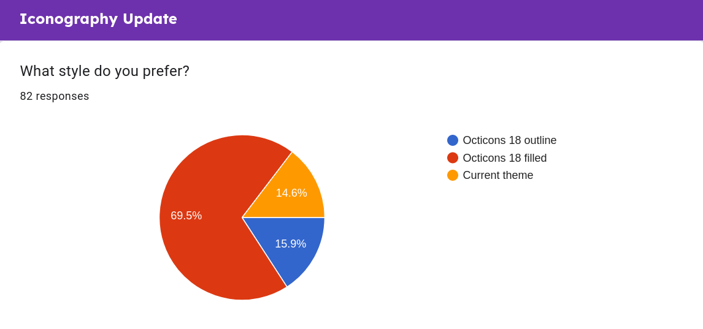
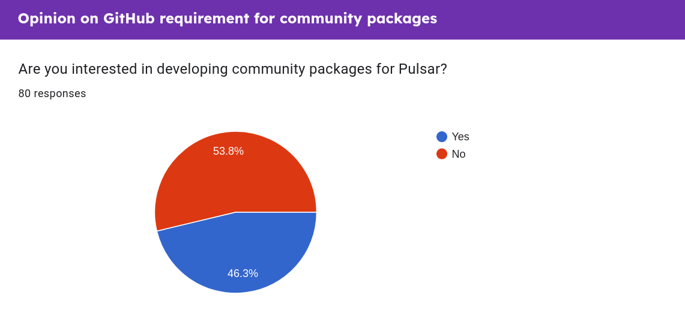

Here we have the results and comments of our second community survey!

<!-- more -->

Thanks to everyone who took part in this survey, we got some great responses, again showing how effective this style of community engagement can be.

The reason for this survey was to gauge some early feedback on a bunch of changes we are looking at making in various areas of the project. We really need to make sure that it is worth making these changes, the last thing we want is to make changes that nobody actually wants that end up making things worse.

Honestly there isn't much more to say as there wasn't really an overarching theme for this one like there was with our [first survey](https://pulsar-edit.dev/blog/20230326-Daeraxa-Survey1-Results.html) so let's just get on with it shall we?

## Iconography

Our first question was asking about upgrading our icon theme in Pulsar. We are updating our [Octicons](https://primer.style/design/foundations/icons/) version bundled with Pulsar to take advantage of changes made between v4.4.0 from 2016 to the current v18.3.0. As part of this we want to explore actually using these new icons in our default UI theme. The questions below are voting on preference between two styles of the new icons against the current theme:

We asked which one was preferred out of these three mock-ups and for any additional comments people would like to make on it.

The outcome of this is fairly clear in that there is a clear preference for the filled icons. This is something we still need to work on (the pictures were only mockups) so it probably won't be in the next release but this gives a us a good indication of the direction we should go with this.

### Comments

There are a few comments here I've picked out to make comment on:

> Wish the icons would be like VSCode icons extension, which react to something if you name a file a certain word, like (images, root, etc) or language images like put the language images in the file, idk how to explain

> As long as is isn't the outline one I'll be happy. Side note, it would be cool if the file icons showed the kind of file.

> Wondering why executable files (shell scripts) look the same as plain text files

These all seem to be on the concept of something like [file-icons](https://github.com/file-icons). The Octicons font simply doesn't have support for every file icon (although it does add some extra ones we would like to include such as icons to indicate binary files or specific types of config file) so we won't be able to add this functionality in this update. The good news is that file icons can be added via a number of [community packages](https://web.pulsar-edit.dev/packages/search?q=file+icons).

> Both new versions are fine, so if possible in the future, make a setting where you can choose?

We probably won't ship a theme for both but the outline icons will be included in the font so it would simply be a case of [creating a theme](https://pulsar-edit.dev/docs/launch-manual/sections/core-hacking/#creating-a-theme) to use the outlined ones instead of the default. All the icons will be shown in the inbuilt style guide `Styleguide: Show` so you can easily pick and choose what ones you want. We may however look at creating a default "legacy" theme that uses the original Octicon icons as they are in Pulsar right now.

## Documentation Site Upgrade

We have plans to overhaul our documentation (both the site/framework and the structure of the documentation). For this we were just after some general feedback on what people like or dislike about the current docs and how it compares to other project documentation.

Whilst I can't address every comment individually, I've picked out a few to address as they are either a common question or a great point that I think needs to be addressed:

### API Docs

> api chapter needed

> Whenever I've tried to use the documentation it seems to be mostly TODO's. So, I'd say that getting the content back to where it was under Atom is more important than fine tuning layout and structure (especially the API documentation).

> The API, that's the most important part of the Atom project, is not accessible. I would love to have an accessible version soon, and one that is fully searchable, possibly by showing the classes and methods as more relevant and a "full text search" also present

So the API stuff has been a little more challenging in terms of the documentation migration from the flight manual. It wasn't actually _part_ of the flight manual but was generated from the Atom team's own API tooling which output in HTML. There were so many discussions about potential API changes and migrating to a more used/supported API docs generation tool (JSDocs) that this got left behind in fear of spending a lot of time getting it ready only to have no good way to automatically update it.  
The good news is that the JSDoc work is well on its way so we should be able to get this added before too long.

### Layout

> Having everything as one huge page is a bit much. Maybe make the subchapters individual pages?

> I think everything in Launch Manual should be moved one level up

> As far as I can see this Launch Manual navigation level is not needed and would clean things up and make it more obvious where things are located by removing this level. At this time I'm not certain what else to provide feedback on.

We agree with these points and this is one of the major areas that is spurring on this rework. We don't want to do anything drastic but we do plan to make navigation a little better and less "monolithic".

### Videos

> Video Tutorials

I won't rule anything out but definitely check out [HTML Tim's YouTube Channel](https://www.youtube.com/@htmltim/videos). He has a ton of fantastic videos on Pulsar itself, how to get the best out of it for different types of languages and info on community packages.

We also had a bunch of comments saying they liked the current docs so we also need to take that into account rather than just going crazy and overhauling everything.

## Community package publishing

Currently, in order to publish a package to the Pulsar package registry it is a requirement to make your package available in a GitHub repository. We were after info to know if this is something that is stopping any of our community from publishing packages.

An interesting almost 50:50 split here, it makes us happy to see so many people are interested in creating packages so we will definitely take that into consideration with our documentation and processes in order to make the publishing and maintenance aspect as good as possible. I can see us asking more questions on the package development experience in the future!

So this was quite enlightening. It is good to know that most people aren't being put off by the current requirement but it is also great to find out that our plans to support other forges or services are in demand. This was very much a question designed to find out if we were a) stopping people creating packages and b) making good use of our resources by looking to expand to other platforms.

## Summary

So thank you again to everyone who took part in this survey, it is fantastic to get so much community engagement on the project. Not only does it help us make informed decisions but getting comments from people clearly passionate and interested in the project is fantastic. It can be easy to get caught in a echo chamber so it is really important to get input from people who may not be as present on our various social platforms but still want to have their voice heard.

As always you can find all the raw data (all checked for any personal or identifiable data) from the survey on our [organization repo](https://github.com/pulsar-edit/.github/tree/main/surveys/20230524-ProjectFeedback).

I don't know when we will have a new survey or what the topic will be but you can be fairly sure there will be one!
