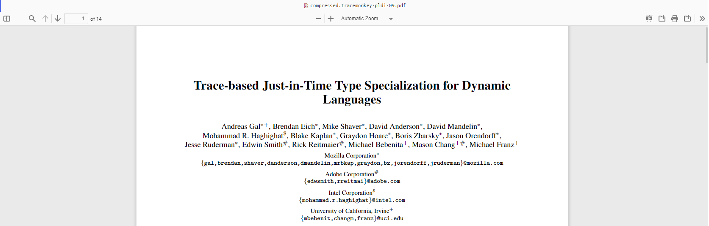

What's this? No... it can't be. But it is! It's the newest instalment of the Pulsar Community Update!

<!-- more -->

# Welcome to the June Community Update

Before we start I just want to I just want to say another big thank you for everyone who took the time to provide feedback in our recent survey for which you can find the results of in a recent [blog post](https://pulsar-edit.dev/blog/20230525-Daeraxa-Survey2-Results.html). We got a lot of useful information again so if you haven't already then you can see our analysis of the results and answers to some of the questions in the previous link.

We have some really exciting news in this month's edition, some automatic detective work on our backend to make life easier for everyone, updates to our [GitHub Discussions](https://github.com/orgs/pulsar-edit/discussions) a community spotlight on one of our most prolific package maintainers and the long await and much hyped arrival of the modernised Tree-sitter implementation!

Enough waffling, lets get on with it!

## Community package feature detection

[@confused-techie] has been busy developing a new feature to our Pulsar Package Repository backend to add "Feature Detection". What does this mean? Well in this case feature detection refers to the analysis of community packages as and when they are published to the repository in order to collect information on what features the package can provide. For example it can determine if the package is providing [snippets](https://pulsar-edit.dev/docs/launch-manual/sections/using-pulsar/#snippets) or a language grammar and, most excitingly, what languages and file extensions that grammar is able to support.

With this we are able to store and use information not explicitly written into the package metadata but actually in the source code of the package itself. This opens a load of possibilities in both Pulsar itself and the package website. For example you could have a filter that explicitly searches only for packages able to provide snippets or all packages that are able to provide a grammar for a particular language to the editor without just returning packages that contain the string you are looking for without the features you want.

However one of the biggest benefits is being able to use this information in Pulsar. A fairly common task when one first installs Pulsar (or any text editor) is getting it set up for the languages you use. Now, whilst Pulsar does support a large number of common grammars out of the box it can't support everything.  
So in the below example I open up a [PON](https://pulsar-edit.dev/blog/20230401-confused-Techie-PON.html) (`.pon`) file and detail the steps needed to get it to display properly.

- Open my `config.pon` file for editing
	- In this case Pulsar doesn't have a grammar for PON and `.pon` files so shows the language as the default `Plain Text` language
- Open the package install pane and search for "PON"
- Search through the [list of returned results](https://web.pulsar-edit.dev/packages/search?q=pon) until I find `language-pon` which looks like it might do what I want it to do and click `Install`.

This looks like a simple process but just look at how many results came back from searching for "PON". This shows the downside of just looking for packages via simple search terms, you have to trust that:
1. A language package actually exists for your language  

and   

2. The package is sensibly named and actually has your search keywords in it (for example searching for "Dockerfile" [returns this](https://web.pulsar-edit.dev/packages/search?q=dockerfile) but the package we might actually want to add dockerfile support is named `language-docker` which is noticably absent).

This new feature would allow us to avoid such a situation altogether. As we are now able to determine what packages can support a given language or file extension we can instead use a much more helpful process:

- Open my `config.pon` file for editing
- Pulsar doesn't have a package for this but it can use the info it has to search the package database, find a package that supports `.pon` files and displays a prompt to the user to download and install from the list of packages it has found.

This approach takes the guesswork out of it completely and will only show you packages that state they have support for that filetype.

Remember this is only one example, we can extend this same behaviour to snippets and potentially other features in the future which we hope will greatly reduce the amount of guesswork and manual searching that has to be performed.

Our biggest challenge here is that we have thousands of existing packages that all need to have this analysis run on them so this won't necessarily be a quick process as we battle against GitHub's API limits but we want to make sure we have all this data ready before we go live with this feature. For new packages this action will be performed at time of publishing/update so this is a one time only thing.

We feel this is a really exciting addition so stay tuned for more info as an when we start implementing this in various places.

## Tree-sitter updates are live!

[^1]

If you have been following these monthly updates then you know that [tree-sitter](https://tree-sitter.github.io/tree-sitter/) has been a common topic and one of our biggest challenges in our goals to bring Pulsar up to date.

So thanks to an awful lot of work by [@savehtheclocktower] and[@maurício szabo] a this project that we have been working on for months has finally hit the rolling releases in an experimental form: [a modernization of the Tree-sitter grammars](https://github.com/pulsar-edit/pulsar/pull/472).

Atom was the first editor to integrate with [Tree-sitter](https://tree-sitter.github.io/tree-sitter/) — a system designed to deliver fast and accurate parsing of [a number of programming languages](https://tree-sitter.github.io/tree-sitter/#parsers) for better syntax highlighting than the traditional TextMate-style grammars.

But being the first editor to support something new is a double-edged sword; in this case it revealed gaps in Tree-sitter functionality that were [addressed in later versions](https://tree-sitter.github.io/tree-sitter/syntax-highlighting#queries). However, Atom’s Tree-sitter support never evolved to match, and that’s the situation that Pulsar inherited.

Now our hand has been forced: security changes in Electron mean that the existing system needs to be converted from the [Node bindings](https://github.com/tree-sitter/tree-sitter/tree/master/lib/binding_web) to the [web-tree-sitter bindings](https://github.com/tree-sitter/node-tree-sitter). We have therefore treated this as an opportunity to overhaul the entire Tree-sitter system and bring it to feature parity with other modern editors that are using Tree-sitter.

To start using the modern Tree-sitter implementation, first download a [rolling release](https://pulsar-edit.dev/download.html#rolling-release). Then find the `Use Modern Tree-Sitter Implementation` option in the Core settings pane and enable it. Any languages with built-in Tree-sitter grammars will now use the modern system.

With the new system enabled, here are a few things you might notice:

- In general, syntax highlighting should be more accurate, and more consistent from language to language.
- Automatic indenting of code now uses a more nuanced system that allows for smarter contextual judgements. For instance, if you type `return foo &&` in a JavaScript file and then hit <kbd>Enter</kbd>, a grammar could be configured to know to add a “hanging” indent on the next line, because it knows that a valid statement in JS can’t end with `&&`. Or a closing brace (`}`) could automatically adjust itself to match the indent level of the line with its corresponding opening brace (`{`), instead of just naïvely unindenting by one level.
- Code folding now uses a new system that collapse meaningful units of a document instead of trying to infer those units based on indentation.
- Commands that rely on Tree-sitter features — like `Editor: Select Larger/Smaller Syntax Node` — should work just like they did with the old Tree-sitter implementation. They’re a useful way to select meaningful sections of your document — for instance, put your cursor inside of a string, press <kbd>Alt + Up</kbd> (or <kbd>Option + Up</kbd>), and the entire inside of the string is selected.

And here are some other things you wouldn’t notice just as a user, but would enjoy the benefits of if you contributed to the Pulsar package ecosystem:

* The system for mapping Tree-sitter semantics to syntax highlighting is much more robust, which means that grammar authors now have a number of extra tools at their disposal.
* Likewise, the systems for describing code folding and indentation will be much more user-friendly than the corresponding systems for TextMate-style grammars. Instead of having to write long, confusing regular expressions, grammar authors will often just be able to describe these behaviours in just a few lines of [query statements](https://tree-sitter.github.io/tree-sitter/syntax-highlighting#queries).
* The results of a Tree-sitter parse are useful beyond the built-in editor duties of highlighting, indenting, and folding. For instance, a Pulsar package could use Tree-sitter to find logical sections of a document, or to associate an identifier with the line where it was defined (in fact, we’re planning to use some of this information to improve the `symbols-view` package and make it more flexible).

With such a large overhaul, there are bound to be bugs. If you’re using the new system and things look or feel worse in any way, I can almost guarantee that it’s not intentional, so please [tell us about it on Discord](https://discord.gg/7aEbB9dGRT) or [file an issue](https://github.com/pulsar-edit/pulsar/issues). If you’re unsure whether it’s the fault of the new Tree-sitter system, try comparing the behaviour with and without the “Use Modern Tree-Sitter Implementation” option enabled.

## GitHub Discussions reorganisation

We just had a [revamp of our GitHub Discussions](https://github.com/orgs/pulsar-edit/discussions/172) which follows a feature that GitHub finally added to allow organisation via sections. This means that we have been able to better separate the various categories into more thematic groups. Hopefully this shows that we do care about and maintain the Discussions area just as much as our other social channels, we don't want people to avoid this area just because it isn't currently as active (chicken or the egg comes to mind here - it won't become more active if people don't use it.). So please, if you want to have a more "long form" discussion or you want a little more of an "asynchronous" type of engagement then Discussions is perfect for that.

So feel free to comment on this organisation work (positive or negative - we won't be offended) and let us know if there is anything else we could be doing to improve it.

## Community spotlight

And finally we want to give a huge shout out this month to **@asiloisad** (aka [@bacadra] who has been creating and maintaining a ton of packages for Pulsar with constant updates making them by far our most prolific package author and maintainer.

To give you an idea of the scale we pulled a few stats from the backend and found that we are looking at 273 updates over 15 packages (bear in mind that this is *only* packages published or updated on the Pulsar Package Repository and doesn't include those that haven't been updated since migration from Atom).

Some of the packages I find particularly interesting and useful are:

- [project-files](https://web.pulsar-edit.dev/packages/project-files) - a package for providing better management and navigation of projects within Pulsar including navigation of the project list, recent projects and even adds autocompletion of path names.

- [navigation-panel](https://web.pulsar-edit.dev/packages/navigation-panel) - this provides an awful lot of stuff that is quite difficult to explain in only a few words but essentially it allows you to add custom symbols to your files

- [pdf-viewer](https://web.pulsar-edit.dev/packages/pdf-viewer) - kind of self explanatory but allows you to open up PDFs directly in Pulsar.

There are tons more packages, have a look at their [GitHub repos](https://github.com/orgs/bacadra/repositories?q=&type=all&language=&sort=) for more.

This is exactly the kind of thing we were hoping to achieve by continuing this project. We know the atom shutdown did a lot of damage to people's confidence in the editor and many dismissed it entirely, archived all their packages and moved on when they saw the sunsetting notice. I really hope that we get more people who are just as enthusiastic about publishing packages and just generally about getting involved in the project. So thank you again **@asiloisad** for all the work you have been putting into this and for putting your faith into this project.

---

And that just about wraps things up for this month's updates. As ever if you want to get more involved the community then feel free to join in on our various [social channels](https://pulsar-edit.dev/community.html). Hope to see you again this time next month!

[@maurício szabo]: https://github.com/mauricioszabo
[@confused-techie]: https://github.com/confused-Techie
[@digitalone1]: https://github.com/Digitalone1
[@spiker985]: https://github.com/spiker985
[@meadowsys]: https://github.com/Meadowsys
[@kaosine]: https://github.com/kaosine
[@savetheclocktower]: https://github.com/savetheclocktower
[@deedeeg]: https://github.com/DeeDeeG
[@htmltim]: https://www.youtube.com/@htmltim
[@bacadra]: https://github.com/bacadra

[^1]: Image from [https://tree-sitter.github.io/tree-sitter/](https://tree-sitter.github.io/tree-sitter/) - Copyright (c) 2018-2021 Max Brunsfeld
