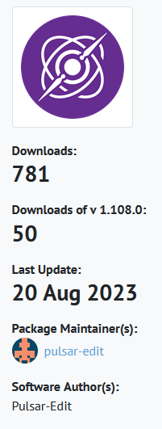

An update on the status of our Chocolatey packages.

<!-- more -->

As you may know, we decided to officially support the [Chocolatey](https://chocolatey.org/) package manager on Windows back in April. However, we quickly ran into a few problems regarding the Pulsar binaries exceeding the size allowed. Unfortunately, this meant that Pulsar was "stuck" on version 1.103.0 whilst we tried to find a solution.

Unfortunately, this went on for rather longer than expected, but thanks to the efforts of a number of people, including [@confused-techie], [@spiker985] and [@COLAMAroro], a solution was found to the problem, and, as a result, the latest regular release of Pulsar is once again available on Chocolatey. Not only that, but all the intermediate releases have also been provided.

Whilst all this was going on, we also realised that the process of actually creating a new release for Chocolatey was a little inefficient and overall too manual, so we took the opportunity to also upgrade our release process into a semi-automated one so that all we have to do is press a few buttons and all the rest is done automatically.

Thank you to all those who have been waiting patiently for this issue to be resolved. With any luck, now that we have our processes for this ironed out, we won't come across anything like this again.

So now you can safely run a cheeky `choco upgrade pulsar` at your convenience to get the latest release installed on your system and enjoy all the updates and upgrades we have been putting into Pulsar these last few months.

[@confused-techie]: https://github.com/confused-Techie
[@spiker985]: https://github.com/spiker985
[@colamaroro]: https://github.com/COLAMAroro
