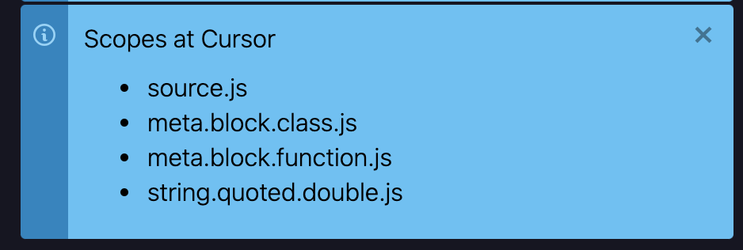

In [the last post](/blog/20230925-savetheclocktower-modern-tree-sitter-part-1.html), I tried to explain why the new Tree-sitter integration was worth writing about in the first place: because we needed to integrate it into a system defined by TextMate grammars, and we had to solve some challenging problems along the way.

Today I’ll try to illustrate what that system looks like and why it’s important.

<!-- more -->

When I first started getting involved with Pulsar back in January, [@mauricioszabo](https://github.com/mauricioszabo/) had just begun the process of migrating us to the `web-tree-sitter` bindings, and seemed to be dreading the enormity of the task.

He noticed that most Tree-sitter parsers had [their own built-in query files](https://github.com/tree-sitter/tree-sitter-javascript/blob/master/queries/highlights.scm) for syntax highlighting. These `highlights.scm` files act like a sort of stylesheet for a Tree-sitter tree: they’re used when you run [`tree-sitter highlight`](https://tree-sitter.github.io/tree-sitter/syntax-highlighting) from the command line, and they’re what GitHub uses when it highlights code in a web browser.

_Couldn’t we just use these files and save ourselves a lot of hassle?_, he asked.

I said no. And I realized that, in saying no, I was volunteering myself to do some hard work.

## How TextMate grammars work

You may not have ever used [TextMate](https://macromates.com/), but you’ve probably used an editor that benefited from its existence. Several widely used editors — first [Sublime Text](https://www.sublimetext.com/), then Atom, and now [Visual Studio Code](https://code.visualstudio.com/) — all based their grammar systems on TextMate’s.

A [TextMate grammar](https://en.wikipedia.org/wiki/TextMate#Language_Grammars) doesn’t aim to understand your code entirely. It uses regular expressions — pattern-matching — to describe rules that identify the important parts of your code. It knows that some rules apply broadly and others are valid only in certain contexts, so it allows you to nest rules inside other rules.

Here’s a very simple example of what a TextMate grammar looks like:

```json
{
	"name": "JavaScript",
	"scopeName": "source.js",
	"fileTypes": ["js", "jsx", "mjs", "cjs"],

	"patterns": [
		{
			"name": "string.quoted.double.js",
			"match": "\\\"(.*?)\\\""
		}
	]
}
```

It’ll feel overwhelming to consider _all_ of the things a grammar does, so for this example I’ve removed all of its rules except for one: the one that highlights double-quoted strings `"like this"`. You can see that it looks for a particular pattern and, when it matches, assigns the name `string.quoted.double.js` to that range. That’s called a **scope name**.

When you load a JavaScript file in Pulsar — or VSCode, or Sublime Text — this grammar will find all your strings and mark them with scope names. In turn, your editor’s syntax theme will hook into that scope name to make that string a special color. (It will most likely target `string`, rather than something more specific, but that’s why scope names are divided into segments; targeting `string` will also match `string.quoted.double.js`.)

Let’s make our grammar a bit more complex:

```json
{
	"name": "JavaScript",
	"scopeName": "source.js",
	"fileTypes": ["js", "jsx", "mjs", "cjs"],

	"patterns": [
		{
			"name": "string.quoted.double.js",
			"begin": "\"",
			"beginCaptures": {
				"0": { "name": "punctuation.definition.string.begin.js" }
			},
			"end": "\"",
			"endCaptures": {
				"0": { "name": "punctuation.definition.string.end.js" }
			},
			"patterns": [
				{
					"include": "#string_escapes"
				}
			]
		}
	]
}
```

This is practically the exact rule for double-quoted strings from Pulsar’s built-in TextMate grammar for JavaScript. It introduces some more advanced concepts:

- Instead of a single pattern, we’ve now got `begin` and `end` patterns. If it can identify a buffer range that starts with a `begin` match and ends with an `end` match, it can scope the entire range that way, and can create a new context in which only certain patterns are applied — in this case, escape sequences.
- The entire string will still be scoped `string.quoted.double.js`, but now we’re also applying `punctuation` scope names to the quote characters themselves.

Here’s a better way to visualize this:


If you were to put your cursor anywhere within a buffer and run the **Editor: Log Cursor Scope** command, you’d see a list of scope names that are active at that buffer position, moving from broadest to narrowest:



Why is it choosing those specific names? Because of [naming conventions established by TextMate](https://macromates.com/manual/en/language_grammars#naming_conventions) many years ago. When different language grammars try to abide by the same conventions for naming their scopes, it makes it easier to write syntax themes without constantly checking how they look in every possible language.

Still, you’d be forgiven if you felt like this was overkill. All we’re doing here is applying some syntax highlighting, right? Do you need this much information just to make a string green?

## How TextMate uses scope names

TextMate has a good reason for wanting such verbose scope names, and for sprinkling them so liberally throughout your source code: they aren’t used _just_ for syntax highlighting.

It’s better to think of scope names as intelligent annotations for your source code. The idea isn’t that you’ll want to make single-quoted strings a different color from double-quoted strings — though you could! — but rather that other editor features could benefit from knowing _whether_ you were inside a string, and _what kind_ of string you were inside.

Because in TextMate, most editor actions — commands, snippets, and macros — can be made contextually aware.

Let’s use commands as an example. Here are some commands you can write in TextMate:

- If the cursor is within a string, pressing <kbd>Ctrl-Shift-’</kbd> should convert the string between single-quoted and double-quoted delimiters.
- If the cursor is in the middle of `{}`, pressing <kbd>Return</kbd> should insert two newlines, put the cursor between the two newlines, and indent the cursor’s line by one level.
- If the cursor is within a URL, pressing <kbd>Enter</kbd> on the number pad should open that URL in a web browser.

In fact, all of these are real examples that are enabled by default in TextMate. And because they target generic scope names that are shared across a number of grammars, they’ll work in nearly any language.

Did you notice how our grammar file defined a `scopeName` of `source.js`? That’s a _root_ scope name, and it applies to the entire file. And it means that commands can restrict themselves to certain languages just like any other context.

For instance: to beautify your JavaScript, you might want to run it through `prettier`. To beautify your HTML, you might want to run it through [HTML Tidy](https://www.html-tidy.org/). And to beautify your JSON, you might want to run it through `jq`.

In TextMate, file beautification commands canonically use the hotkey <kbd>Ctrl-Shift-H</kbd>. By applying the right scope selector for each of these three commands, you can assign them _all_ to <kbd>Ctrl-Shift-H</kbd>, and they won’t get in each other’s way.

## How Pulsar uses scope names

There are a number of reasons why TextMate isn’t widely used anymore: it’s a macOS-only editor, its releases are frustratingly sporadic, and it’s never had support for crucial features like split editor panes. But TextMate was a major influence on how Atom was built.

It’s not widely known, but **Atom and Pulsar offer nearly as much flexibility with scope names as TextMate does**:

- Any snippet can be defined to run in an arbitrary scope context. For instance, you could write a snippet that will only expand if you’re inside of a JavaScript block comment; if you try to invoke it elsewhere, it’ll act as though that snippet doesn’t exist.

  Built-in packages use this system. For instance, the `language-html` package defines snippets for most common tag names, but then redefines each one to do nothing if the cursor is inside a context where HTML would be invalid, like a `style` or `script` element.

- Pulsar’s configuration system allows for scope-specific overrides. For instance, a user can set `editor.softWrap` to `false` globally, but set it to `true` for Markdown files.

  Built-in packages use this system. Scopes can be used to set config values that aren’t exposed in the UI — like what to use for comment delimiters in a given language, or which non-letter characters should be considered to be part of a “word” for the purposes of cursor navigation.

- In Pulsar, commands can be invoked anywhere, whether the user is in a text editor or not; hence there’s no strong system for enforcing that commands be invoked only in certain scope contexts.

  But it’s possible! I’ve got several commands in my `init.js` whose only purpose is to inspect the scope list of the active text editor’s cursor, then delegate to one of several other commands depending on where the cursor is. It’s not as easy as it could be, but the bones are there.

But that’s not all. If you use Pulsar, chances are very good that you use a package — built-in or third-party — that inspects scope names for contextual information. Here are just a few of _many_ examples:

- `autocomplete-plus` inspects scopes to decide whether it should offer suggestions at the cursor; it declines to do so whenever any of the current scopes matches a user-configurable list. (This is how it decides _not_ to offer suggestions if you’re typing within a comment, for instance.)
- `autocomplete-css` decides which suggestions to offer based on the scope name of the closest token.
- `bracket-matcher` uses scope names to locate and highlight paired tokens like brackets and matching HTML tags.
- [`emmet`](https://web.pulsar-edit.dev/packages/emmet), the eighth-most-downloaded community package, relies on scope descriptors to decide whether it should try to expand an abbreviation into HTML.

## What would break?

With this in mind, let’s go back to those built-in Tree-sitter query files and consider our string example. In [`tree-sitter-javascript/queries/highlights.scm`](https://github.com/tree-sitter/tree-sitter-javascript/blob/master/queries/highlights.scm#L85-L88) we can see how strings are treated:

```scm
[
  (string)
  (template_string)
] @string
```

This rule treats three different kinds of strings — single-quoted, double-quoted, and backtick-quoted — identically. If we used this rule as written, we’d be applying a scope name of `string` to all JavaScript strings. Not `string.quoted.double.js` and the like; just `string`. And there’s no rule in that file that applies scope names to string delimiters, either.

If we embraced a system that used names like `string` and `comment` instead of `string.quoted.double.js` and `comment.block.documentation.js`, the editing experience would be worse in a number of ways ways — some tiny, some large.

To drive it home for you, let’s think of all the things that would break from this change alone:

- Any community syntax theme that chose to style double-quoted strings differently from single quoted strings would suddenly behave differently. (Far-fetched? Consider a language like PHP or Ruby in which single-quoted strings have different semantics from double-quoted strings.)
- Any community syntax theme that chose to style string delimiters in a certain way — with a bolder weight, perhaps — would suddenly behave differently, because the `punctuation` scopes would no longer be present on the delimiters.
- Any user-defined snippet that is scoped specifically to `string.quoted.double` — or even `string.quoted` — would break.
- Any user-defined commands that looked for the presence of a `punctuation` scope to detect whether the cursor is adjacent to a string delimiter would break.

I think Atom learned this lesson rather well during the original rollout of Tree-sitter grammars. After updating, users were defaulted to the new grammars. Sometimes things looked different, or behaved differently. When users reported these differences, they learned that they could work around those bugs in the short term by unchecking the “Use Tree-Sitter Grammars” setting and restoring the original behavior. I wonder how many did, and how many of them ever re-enabled Tree-sitter grammars in the future.

A lot of code has been written that presumes the existence of TextMate-style scopes. I think this is fine. The fact that we have a new system doesn’t mean that we should leave scopes behind. For one thing, it’d be a jarring experience for users — we’d be bragging about a new feature that was likely to break customizations that users had been relying upon for years.

But I also think that TextMate-style scopes function as an elegant [middleware](https://en.wikipedia.org/wiki/Middleware). They allow us to change an underlying implementation without the user needing to know or care — except, perhaps, to notice downstream benefits, like faster syntax highlighting and new editor features.

## The challenge

So that’s why I volunteered to do this. I knew that we couldn’t just reuse some syntax highlighting query files that were written with different assumptions in place. And I knew that I couldn’t reasonably ask _someone else_ to do a bunch of work just because _I_ felt like it was important.

My goal was to create a set of grammars that had the performance and accuracy upsides of the Tree-sitter experience _and_ the rich scope name annotations that TextMate grammars provided.

For that to be possible, Tree-sitter grammars should apply scope names **as similarly as possible to TextMate grammars**. There may be reasons that we _choose_ not to do something the way that the TextMate grammar does it, but we don’t want to be _unable_ to do something the way that the TextMate grammar does it.

Syntax highlighting was the first, and hardest, task. Next time I’ll talk about how we solved it.
