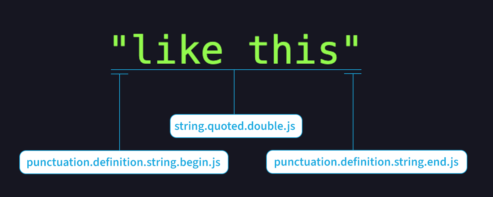

[Last time I laid out the case](https://pulsar-edit.dev/blog/20230927-savetheclocktower-modern-tree-sitter-part-2.html) for why we chose to embrace TextMate-style scope names, even in newer Tree-sitter grammars. I set a difficult challenge for Pulsar: **make it so that a Tree-sitter grammar can do _anything_ a TextMate grammar can do.**

Today I’d like to show you the specific problems that we had to solve in order to pull that off.

<!-- more -->

If you’d like to follow along with these code examples in your own Pulsar installation, I’d suggest installing the [`tree-sitter-tools` package](https://web.pulsar-edit.dev/packages/tree-sitter-tools). It includes a language grammar for the Tree-sitter query files we’ll be spending most of this article writing, and it lets us visualize the syntax trees that Tree-sitter produces.

If you just want to get a sense of what a Tree-sitter tree looks like, you can use the [Playground on the Tree-sitter web site](https://tree-sitter.github.io/tree-sitter/playground).

## The problems

The legacy Tree-sitter integration into Atom used its own system for mapping tree nodes to scope names, but it had **two major limitations** that prevented it from matching the scope names produced by a TextMate grammar:

1. **It couldn’t query the right nodes**: it used a CSS-like syntax that was limited in how expressively it could describe tree nodes.
2. **It couldn’t describe the right ranges**: it could only add scopes to ranges that corresponded to individual tree nodes.

The need to write an Atom-specific bridge between node names and scope names served as evidence that Tree-sitter need its _own_ system for more easily working with syntax trees — one that would prevent every Tree-sitter consumer from having to reinvent the wheel.

So Tree-sitter added a powerful [query system](https://tree-sitter.github.io/tree-sitter/using-parsers#pattern-matching-with-queries), with a Lisp-like syntax most directly influenced by [Scheme](<https://en.wikipedia.org/wiki/Scheme_(programming_language)>). This system wasn’t around for the legacy implementation to use — but it’s here for us now, and it’s going to make our job much easier.

Tree-sitter query syntax does the same thing for a Tree-sitter syntax tree that CSS selector syntax does for HTML: it gives us a terse way to describe a set of nodes in a tree. And just as people eventually realized that CSS selector syntax was useful for more than just styling — see [`document.querySelector`](https://developer.mozilla.org/en-US/docs/Web/API/Document/querySelector) — you’ll soon see that Tree-sitter queries are useful for more than just making strings green.

Right now, though, let’s just focus on syntax highlighting. And remember those two limitations that I described above, because we’ll have to solve them both before this article is done.

## The first challenge: robust querying

I’ll remind you of our example from part 2: the scope names applied to a double-quoted string in JavaScript.



Our first goal is to make it so that our JavaScript Tree-sitter grammar can apply these same scopes to the same buffer ranges. But Tree-sitter works very differently to a TextMate grammar, so it’s not immediately obvious how we can pull this off. Let’s reason through it.

### How captures work

Tree-sitter itself [has demonstrated](https://tree-sitter.github.io/tree-sitter/syntax-highlighting) how query files can be used to highlight code. If a parser has a `highlights.scm` file defined in its repository, the CLI will allow you to run `tree-sitter highlight` on arbitrary input. It’ll parse the input, figure out which parser should do the job, use that parser’s `highlights.scm` to map certain nodes to query capture names, and then emit highlighted output in your terminal.

Last time I showed you this excerpt from `tree-sitter-javascript`’s `highlights.scm` file:

```scm
[
  (string)
  (template_string)
] @string
```

Once you’re familiar with query syntax, the outcome of this query is clear: all JavaScript strings will be captured and given a name of `@string`. Somewhere within the `tree-sitter highlight` code path, those capture names are mapped to various colors, and are applied to the captured buffer ranges. Anything that gets captured as `@string` will have one color in the output; anything that gets captured as `@keyword` will have a different color; and so on.

**Let’s imagine that Pulsar has a similar system.** In order to keep this article from putting you to sleep, I won’t get into the details of exactly _how_ we do it, but the machinery is in place. Instead of a capture name like `@string`, we’ll be choosing more verbose names like `@string.quoted.double.js`, but the principles are the same.

We also won’t be talking about how Pulsar knows which areas of the buffer to re-highlight as the user makes changes, nor how Pulsar combines the results of multiple parsers (for example, JavaScript embedded in HTML). These topics may be visited in future articles, but today we’re just talking about how to use Tree-sitter queries to identify arbitrary ranges and give them the scope names that we want.

### Highlights

What does a string look like in a Tree-sitter tree? Let’s create a new document with nothing but the following contents:

```js
"like this";
```

Using the [tree-sitter-tools package](https://web.pulsar-edit.dev/packages/tree-sitter-tools), I can open an inspector pane and look at the raw tree for this string:


So we can see that a `string` node consists of three parts: a delimiter, a `string_content` node, and another delimiter. This structure maps elegantly to the things that we want to scope.

Most parsers build [_abstract_ syntax trees](https://en.wikipedia.org/wiki/Abstract_syntax_tree). In the process of making the tree, they discard lots of information that isn’t important to the parser’s goal. But Tree-sitter builds _concrete_ syntax trees! Every character in our JavaScript file will end up being represented by at least one node, and every node remembers the exact buffer range it covers. If it didn’t, we wouldn’t be able to use it for syntax highlighting.

In Tree-sitter parsers, nodes that matter to semantics (like `string_content`) tend to have names, whereas other nodes (like the delimiters) are “anonymous” nodes. Anonymous nodes can still be queried against like named nodes, so it feels like it’ll be pretty easy to apply the scopes that we want.

So let’s open our grammar’s `highlights.scm` file and give it a try. (In Pulsar’s “dev mode” — which you can trigger with the `--dev` flag on the command line — grammar authors can even make changes to their query files and see them take effect instantly when they save!)

```scm
(string) @string.quoted.double.js
```

That’s not bad, but it’s too specific. In `tree-sitter-javascript`, the `string` node applies for both single-quoted and double-quoted strings, with the difference being reflected only in the anonymous nodes. (Template strings, as we saw above, have their own node type.)

How do we distinguish single-quoted strings from double-quoted strings? Here’s one thing we could do:

```scm
((string) @string.quoted.single.js
  (#match? @string.quoted.single.js "^'"))
((string) @string.quoted.double.js
  (#match? @string.quoted.single.js "^\""))
```

The built-in `#match?` predicate allows us to reject possible matches when their contents don’t match a given regular expression. Here we’re telling the query engine to distinguish between `string` nodes whose text starts with `'` and those whose text starts with `"`.

We’ll be using the `#match?` predicate a lot. Unlike some of the other predicates we’ll see shortly, it’s _implemented_ by the `web-tree-sitter` bindings, so Tree-sitter on its own is able to reject would-be captures that don’t pass it. By the time we see the list of captures, those that have failed a `#match?` test have already been filtered out.

In this case, though, there’s an even easier way to tell these strings apart:

```scm
(string "'") @string.quoted.single.js
(string "\"") @string.quoted.double.js
```

As I mentioned, we can query for the presence of anonymous nodes. So the first line will match any `string` that contains at least one anonymous node child named `'`, and the second line will match any `string` that contains at least one anonymous node child named `"`.

Since the capture name is on the outside of the closing parenthesis, the capture name applies to the whole `string`.

We don’t have to be more specific; if that anonymous node exists _at all_, then it’s used as a delimiter on both sides of the string. And this query won’t match any potential false positives — like a double-quoted string that happens to have a `'` somewhere inside of it — because the parser is too smart to get tripped up by that sort of thing.

This is one reason why it’s very easy to make a new Tree-sitter grammar _if_ someone has done the work of writing a Tree-sitter parser for the given language. If we were writing a TextMate grammar, we’d have to care about a lot more of these edge cases, but a Tree-sitter parser will have handled them for us already.

### Scope tests

We can already tell that the expressiveness of Tree-sitter’s query system will go a long way toward solving the first of the two problems we described above. Last time around, Atom developers had to _invent_ a system for querying the tree, but we get a much more powerful system for free.

Tools like anonymous nodes and `#match?` predicates can get us quite far on their own, but they can’t solve all of our problems. We still have to scope the quotation marks themselves, and we may _think_ we know how to do it:

```scm
(string "'" @punctuation.definition.string.begin.js)
```

By putting the capture name immediately after the `"'"`, we can target that anonymous node and give it a name. But remember that there are two delimiters! We want to give one scope name to the beginning delimiter and a _different_ scope name to the ending delimiter. As we’ve written it, this rule would match _both_ delimiters.

Surprisingly, we can’t solve this problem without some external help. Tree-sitter queries [have a concept of “anchors”](https://tree-sitter.github.io/tree-sitter/using-parsers#anchors) that can enforce positioning of children — for instance, targeting only the first node child of a parent — but they can be used only for _named_ nodes, not anonymous nodes. **We need a way to introduce our own filtering criteria into Tree-sitter queries.**

Luckily, Tree-sitter gives us the tools to write our own predicates. Instead of trying to make it aware of our application-specific concerns, we can use the generic predicates `#is?` and `#is-not?` to mark certain query captures with data, then use that data to filter the results however we like.

The downside is that Tree-sitter can’t approve or reject captures with these predicates _on its own_ like it can with `#match?`. Instead, we’ll have to “process” these captures after the fact and filter them manually. But it’s worth the effort because it lets us use whatever logic we want — even Pulsar-specific logic that means nothing to Tree-sitter.

Let’s illustrate.

```scm
(string
  "'" @punctuation.definition.string.begin.js
  (#is? test.first "true"))
```

The two parameters after `#is?` are arbitrary values of my own invention. Tree-sitter simply treats them as a key and value and applies some metadata to this capture. Any nodes that get captured by this query will contain some data under `assertedProperties`:

```js
capture.assertedProperties["test.first"]; //-> "true"
```

In fact, I can omit that second argument; for boolean tests like this one, the presence of the property is all we need:

```scm
(string
  "'" @punctuation.definition.string.begin.js
  (#is? test.first))
(string
  "'" @punctuation.definition.string.end.js
  (#is? test.last))
```

Using `(#is? test.first)` is like having Tree-sitter attach a Post-It note to a capture object with the text “remember to assert `test.first` later” written on it. Tree-sitter doesn’t know or care what that means, but it assumes we will.

And in this case, `test.first` corresponds to a function we’ve written that looks like this:

```js
function first(node) {
	if (!node.parent) return true;
	return node?.parent?.firstChild?.id === node.id;
}
```

This function first ensures that root nodes (which have no parent) will always pass the test. Then it compares our node to its parent’s first child. If they’re equal, the test passes. If they’re not, then the captured node isn’t the first child of its parent, and we can ignore it.

The logic for our `last` function is identical, except that it compares our `node` to `node.parent.lastChild`.

Even better: the existence of `#is-not?` means that we get negation practically for free. Suppose I did this:

```scm
(string
  "'" @punctuation.definition.string.end.js
  (#is-not? test.first))
```

Then the metadata would exist in a different place…

```js
"test.first" in capture.refutedProperties; //-> true
```

…and I’d know to ignore this capture unless my `first` function _fails_ for this node.

So now we’ve got a way to filter capture names by any criteria we can think of. If we can test for it in JavaScript, it can be used as a predicate in Tree-sitter queries.

We call these custom predicates **scope tests**, and we’ve grouped them under a `test.` namespace for reasons that may make more sense later. Scope tests are a crucial tool for solving the first of those two problems we described earlier: they let us query for tree nodes in arbitrary ways that the legacy system simply couldn’t.

And because scope tests are just JavaScript, we’re able to use some oddball criteria for accepting or rejecting captures. Consider these examples:

```scm
((program) @source.js.embedded
  (#is? test.injection))

(variable_declarator
  name: (identifier) @constant.other.foo
  (#match? @constant.other.foo "^[_A-Z]+$")
  (#is? test.config "language-foo.highlightAllCapsIdentifiersAsConstants"))
```

Both of these are scope tests that grammar query files can use. The first one applies a scope _only_ if we’re in an injection layer — for instance, if this is JavaScript inside of a `SCRIPT` tag in an HTML file. The second one applies a scope only if the user has enabled a certain configuration option. Neither one has anything to do with Tree-sitter itself, but we can use them in Tree-sitter query files all the same.

The logic for applying tests and winnowing a list of raw captures exists in Pulsar in a class called `ScopeResolver`. That `first` function defined above is present at [`ScopeResolver.TESTS.first`](https://github.com/pulsar-edit/pulsar/blob/v1.109.0/src/scope-resolver.js#L583-L591), and there’s logic in `ScopeResolver` that matches up a `test.first` property to that function.

There are other scope tests that we’ve found to be quite useful — tests which any grammar author can use in their own query files:

- Whether a node has a certain kind of node as an ancestor
- Whether a node has a certain kind of node as a descendant
- Whether a node is the first/last non-whitespace content on a row
- Whether a node has arbitrary metadata that has been attached with Tree-sitter’s `#set!` predicate

But for our current goal — applying `punctuation` scopes to string delimiters — implementing `test.first` and `test.last` is enough to get us the outcome we want.

You may remember from earlier that the legacy Tree-sitter integration used a CSS-like syntax to describe nodes. It supported combinators like `>` and even pseudoclasses like `:nth-child`, but not much else. Tree-sitter’s own query system can do much more than that — and it’s extensible, so we can add our own logic wherever we need it.

So we’ve done it! We now have the ability to scope a JavaScript string identically between our two different grammar systems. And we’ve moved past the legacy system’s first drawback: a brittle query system. Our first challenge has been vanquished.

## The second challenge: scoping arbitrary ranges

To solve the second drawback — inability to scope the correct ranges — let’s create another challenge.

TextMate grammars will scope comments differently based on whether they’re line comments or block comments. There’s also a convention to annotate `comment.line` scopes with their delimiter type:

```js
// this is a comment
```

A typical TextMate grammar for JavaScript would scope this comment as `comment.line.double-slash.js`, and would further scope the `//` as `punctuation.definition.comment.js`.


Can we do that in a Tree-sitter grammar with the tools we’ve already got? Let’s inspect what our example comment looks like in a Tree-sitter tree:


Hmm. No anonymous nodes or anything. Just one node called `comment`.

It’s a strong Tree-sitter convention that various sorts of code comments are all represented by nodes called `comment`. So this query would do the right thing in our example…

```scm
(comment) @comment.line.double-slash.js
```

…but would be incorrect in other scenarios because it would match block comments as well as line comments.

But we can use `#match?` to distinguish between the two kinds of comments:

```scm
((comment) @comment.line.double-slash.js
  (#match? @comment.line.double-slash.js "^\/\/"))

((comment) @comment.block.js
  (#match? @comment.block.js "^\/*"))
```

In the latter case, we don’t have to test for the presence of `*/` at the end. If the contents of the comment begin with `/*`, that’s all the information we need; we know it _must_ end with `*/`, or else the parser wouldn’t have classified it as a comment.

But what about our `punctuation.definition.comment.js` scope? Sadly, `tree-sitter-javascript` (and most other parsers) don’t make it easy to target the comment delimiters themselves. Comment delimiters, unlike string delimiters, usually aren’t available as anonymous nodes.

Hence the legacy Tree-sitter system has never been able to annotate that `//` with the `punctuation` scope it needed. We’ll need to solve this ourselves.

### Scope adjustments

In this case, it’d be _more convenient_ if there were a node for the `//` we want to scope. But we control the internals of the editor, and we can tell it to apply scope names to whatever buffer ranges we want. When the tree doesn’t do all of our work for us, it just means we have to try a bit harder.

In this case, the `comment` node tells us where the comment _starts_ in the buffer. And once it passes the `#match?` predicate, we _know_ that it starts with `//`, so it _must_ end two characters later. Not the hardest problem to solve!

The trickiest part will be figuring out _how to describe_ these buffer positions in a query.

#### Adjusting by pattern

What if we did this?

```scm
((comment) @comment.line.double-slash.js
  (#match? @comment.line.double-slash.js "^//"))

((comment) @punctuation.definition.comment.js
  (#match? @punctuation.definition.comment.js "^//")
  (#set! adjust.endAfterFirstMatchOf "^//"))
```

Here we’re capturing the same thing _twice_ under different names. In the second case, we’re using `#set!` — a predicate very similar to `#is?` and `#is-not?` — to attach a qualifier: instead of stopping at the end of the line comment, stop right after the `//` near the beginning.

Just like `#is?` predicates are represented on captures under `assertedProperties` and `#is-not?` predicates are represented under `refutedProperties`, `#set!` predicates are represented in their own bucket simply called `properties`.

Note the semantic difference between a predicate that ends in `!` and one that ends in `?`. In this case we’re not setting up a test for the capture to pass or fail; we’re attaching a side effect to the capture. Imagine a Post-It note attached to the capture that says “remember to adjust the range for this capture to end at X.”

I mentioned earlier that all nodes remember their corresponding buffer range — starting at _row W and column X_, ending at _row Y and column Z_. By default, this is the range against which a scope is applied. But in this case, the `adjust.endAfterFirstMatchOf` predicate reminds us to execute a regular expression match on the node’s contents and move the ending position to _the end of that match_, instead of the node’s natural ending point.

So in the absence of any node boundary at the position we want, we’ve found a rather simple alternative way to express that position. We still have to write [our own code](https://github.com/pulsar-edit/pulsar/blob/v1.109.0/src/scope-resolver.js#L883-L897) to make it happen, but that won’t be a problem. Since we already have to loop through our captures to apply scope tests, we might as well use that opportunity to tweak the range of a capture if we need to.

And how would we handle the delimiters of a block comment?

```scm
((comment) @comment.block.js
	(#match? @comment.block.js "^/\\*"))

((comment) @punctuation.definition.comment.begin.js
  (#match? @punctuation.definition.comment.begin.js "^/\\*")
  (#set! adjust.endAfterFirstMatchOf "^/\\*"))

((comment) @punctuation.definition.comment.end.js
  (#match? @punctuation.definition.comment.end.js "\\*/$")
  (#set! adjust.startBeforeFirstMatchOf "\\*/$"))

```

We can scope the opening delimiter the same way. To scope the ending delimiter, we move the _head_ of the range to the position at the _beginning_ of a regex match. (And for situations where you want to move both the head and the tail at once, there’s `adjust.startAndEndAroundFirstMatchOf`).

#### Adjusting by node position descriptor

Let’s look at another example.

```js
function SomeComponent(props) {
	return <SomeOtherComponent {...props} />;
}
```

Let’s say we want to scope the `/>` at the end of the self-closing tag. Tree-sitter represents that as two separate anonymous nodes — `/` and `>`.

So we’ve got a _different_ problem here: there’s no _single_ node that includes both boundaries of the range we want to scope. How can we make the scope span two adjacent nodes?

We could probably use a pattern-based solution here like we did above. But we could also leverage a useful feature of how nodes are represented in the tree.

You might be familiar with how [DOM nodes in the browser](https://developer.mozilla.org/en-US/docs/Web/API/Node) are traversible via properties like `parentNode`, `nextSibling`, and so on. If you’ve got a reference to a particular DOM node, you can use those properties to jump from that node to any other node in the tree, as long as you you know how the two nodes are related.

A similar system exists for Tree-sitter nodes, and it gives us a simple way to describe relationships between nodes:

```scm
((jsx_self_closing_element
  ; The "/>" in `<Foo />`, extended to cover both anonymous nodes at once.
  "/") @punctuation.definition.tag.end.js
  (#set! adjust.startAt lastChild.previousSibling.startPosition)
  (#set! adjust.endAt lastChild.endPosition))
```

Here we’re capturing the entire self-closing element, then moving the ends of the range to the specific boundaries that we need: starting at the beginning of second-to-last node child, and ending at the end of the last node child. The `/` and `>` will always be the last two children of the node we captured, so this is a simple and repeatable way to describe the boundaries we want.

This syntax for describing a position relative to a given node is something we call a _node position descriptor_. If you’ve ever used a function like [Lodash’s `_.get`](https://docs-lodash.com/v4/get/), you might feel at home with this syntax — it resolves a chain of property lookups all at once, and fails gracefully if any of them aren’t present. It’ll come in handy later for other purposes.

So in order to pass our “JavaScript line comment” challenge, we’ve had to invent another feature called **scope adjustments**. With the infrastructure we’ve already got, scope adjustments are an easy thing to add: a scope adjustment is just a function that accepts a capture object and returns a range. We process them in the post-capture phase immediately before we apply scope tests.

Scope adjustments are our answer to the legacy system’s second limitation. They allow us to embrace the syntax tree when it works in our favor, but still break free of it whenever we need to.

## What does this get us?

Some of you, having gotten this far, might wonder to yourselves: _if it takes this much effort just to get feature parity with a TextMate grammar, why not just stick with TextMate grammars?_

One answer is simple: despite how complex this may seem, and how many implementation details I’ve hidden from you, the effort it’s taken to integrate Tree-sitter grammars into Pulsar is much, much less than the effort it originally took to integrate TextMate grammars into Atom.

But the message here can’t just be “we implemented a cool new thing that you won’t notice at all!” The whole point is that this is _better than_ — not just _equivalent to_ — what we had before, and not just for the few of us who write grammars.

So let me give you an example of something that was very hard with a TextMate grammar, but is now quite easy.

When a scope name might be useful for semantic reasons, but not for syntax highlighting reasons, TextMate grammars add scope names that use the `meta` namespace. You might see some `meta` scope names when you run the “Log Cursor Scope” command, but most of them don’t have an effect on how your code looks. Yet that information is visible to snippets, settings, and commands, and it can be very useful.

In the `language-javascript` package, Pulsar defines a `fun` snippet that expands as follows, with the string `functionName` highlighted:

```js
function functionName() {}
```

That’s great, but there’s more than one syntax for defining functions. Imagine if you could use `fun` inside of a class body and have it expand to the correct syntax for defining an instance method:

```js
class Foo {
	functionName() {}
}
```

Or inside of an object literal — much like the class body syntax, but with a trailing comma so as to prevent syntax errors:

```js
const Foo = {
	functionName() {},
};
```

**TextMate grammars weren’t built with this sort of thing in mind.** With much effort, you could probably pull it off, but only by making the grammar so complex that it might as well be a parser. But Tree-sitter is _already_ a parser. It understands your code well enough to make these things _easy_.

With our rich syntax tree, we can now apply `meta` scope names rather liberally, marking sections of the buffer with useful metadata that can be used by commands and snippets. We can scope the inside of a class body and the inside of an object literal:

```scm
; The interior of a class body.
((class_body) @meta.block.class.js
  ; Start after `{`…
  (#set! adjust.startAt firstChild.endPosition)
  ; …and end before `}`.
  (#set! adjust.endAt lastChild.startPosition))

; The inside of an object literal.
((object) @meta.object.js
  ; Start after `{`…
  (#set! adjust.startAt firstChild.endPosition)
  ; …and end before `}`.
  (#set! adjust.endAt lastChild.startPosition))
```

By defining these two scope names, we’ve exposed these concepts to all the systems that consume scope names, including snippets.

The `language-javascript` package already defines `fun` one way, but we can redefine it for more specific scopes:

```coffeescript
'.source.js .meta.block.class.js':
  'Function':
    'prefix': 'fun'
    'body': '${1:functionName}($2) {\n\t$0\n}'

'.source.js .meta.object.js':
  'Function':
    'prefix': 'fun'
    'body': '${1:functionName}($2) {\n\t$0\n},'
```

Now we’ve made the `fun` snippet much more useful. When we type `fun` and press <kbd>Tab</kbd>, the `snippets` package will pick the version that matches the context of the cursor most closely.

<video style="max-width: 100%" autoplay controls muted>
	<source src="@source/blog/assets/tree-sitter-snippet-context-example.webm" type="video/webm">
	<source src="@source/blog/assets/tree-sitter-snippet-context-example.mp4" type="video/mp4">
	<p>Your browser doesn’t support HTML video. <a href="@source/blog/assets/tree-sitter-snippet-context-example.mp4">Download this video</a> instead.</p>
</video>

This will work identically whether you use tab triggers or choose your snippets from an autocomplete menu.

This change isn’t just theoretical; it’s been implemented in the `language-javascript` grammar package, and it shipped with Pulsar 1.109.

## Next time

Syntax highlighting isn’t the only way that Tree-sitter’s query system can make our lives easier. In the next installment we’ll tackle two tasks that the legacy Tree-sitter integration never addressed: indentation and code folding.
