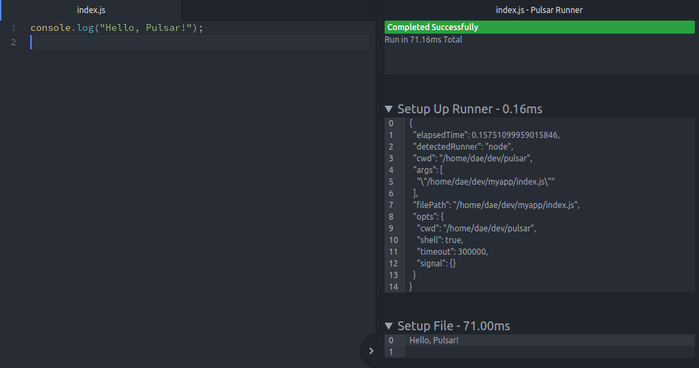

What month is most important for a Pulsar? A supernova-ember! ...What isn't a bad joke is this, the Pulsar community update!

<!-- more -->

# Welcome to the November Community Update!

Another warm welcome to the Pulsar community update, where we cover new developments and events in the world of Pulsar. This month we have a couple of really significant changes to how Pulsar works internally by creating a couple of new APIs that can be used throughout the application, a new package to help you run code directly within Pulsar and our usual community spotlight to say thank you to those community members contributing to Pulsar's development!

## New `UI` API

Pulsar has a number of different methods of rendering UI components, which tend to differ between the various core packages that make up the main Pulsar editor. This is particularly evident when dealing with Markdown rendering, where different packages may be using different versions of the same dependencies, which all have to be taken into account when updating them. To this end, [@confused-techie] has been implementing a new `UI` API that will simplify all of these disparate methods into a single new API.

The focus will be on Markdown to start with, simply because this is where we are having to spend a lot of effort re-implementing features. For example, our 'settings-view' package needs to display package READMEs and relies on a library called [marked](https://marked.js.org/). However, this isn't the only place where READMEs will be displayed. Not only do we have our own [Pulasr Package Registry](https://web.pulsar-edit.dev/) website powered by [package-frontend](https://github.com/pulsar-edit/package-frontend) using the [markdown-it](https://github.com/markdown-it/markdown-it) parser, but we also have to consider how it is displayed on GitHub, which is currently the only method of publishing packages to the PPR.

By removing all these independent implementations across various core packages, we should be able to reap the following benefits:

- With only a single version of each dependency, the overall install size can be reduced.
- Likewise, there is less overhead associated with keeping things up-to-date, and it will be easier to update when needed.
- Improvements added to the community package READMEs can be used everywhere, not just on the Pulsar Package Website.
- We could introduce global Pulsar settings for greater control over how markdown is parsed, which can apply to every package that uses this API. For example, enabling emojis, adding copy buttons to code blocks, disabling syntax highlighting and modifying links or images.
- Automatic redirection of "dead" `atom.io` URLs to the `pulsar-edit.dev` or web archive equivalent.

Of course this new API will also be available for use by community packages for developers to take advantage of if they wish, so that Markdown parsing doesn't need to be independently implemented any more.

This new feature is availble in our newest rolling releases and will soon be in our regular release too!

## Exposing a `fuzzy-native` API

In a similar vein to the above, we also have a [fuzzy-native](https://github.com/pulsar-edit/fuzzy-native) package used to provide fuzzy string matching for Pulsar. This package is used as a dependency for a large number of Pulsar packages, including core packages such as `fuzzy-finder`, `command-palette` and `autocomplete-plus`. The goals here are very similar to those for the new UI API mentioned above; instead of each package needing to specify (and bundle) `fuzzy-native` as a dependency, they can instead simply reference this new global API, saving the need to bundle it as a dependency and having to maintain each package that uses it.

You can view the progress of this work over on [its pull request](https://github.com/pulsar-edit/pulsar/pull/774) by [@mauricio szabo].

## A new code runner package

[@confused-techie] has been working on a new package for running scripts and code directly within Pulsar. The inspiration comes from some existing packages that still work and can be installed, but few of the most popular ones are still actively maintained. Having an integrated code runner package is a common request from new Pulsar users wondering how they can run code directly in the editor in much the same way as is possible within other editors such as VSCode. We are currently discussing the best way to bring this kind of functionality to users; should we publish this as a package, include it as a new core package, or something in-between? Whatever the outcome, you can look forward to more news on this package soon!

If you want to check it out in its current, in-development state, then have a look at the [pulsar-runner](https://github.com/confused-Techie/pulsar-runner) repository.

## Further installments in the modern Tree-sitter blog post series

[^1]

Continuing on from [last month's entry](https://pulsar-edit.dev/blog/20231004-Daeraxa-OctoberUpdate.html#modern-tree-sitter-blog-posts) we have posted two new blog posts by [@savetheclocktower] on the topic of Pulsar's modern Tree-sitter implementation. So if you haven't seen those posts, then you can continue onto parts [three](https://pulsar-edit.dev/blog/20231013-savetheclocktower-modern-tree-sitter-part-3.html) and [four](https://pulsar-edit.dev/blog/20231031-savetheclocktower-modern-tree-sitter-part-4.html) on the topics of syntax highlighting and indentation & code folding respectively.

## Community spotlight

A big thanks this month to [@danfuzz] for the [identification](https://github.com/pulsar-edit/pulsar/issues/775) and [fix](https://github.com/pulsar-edit/pulsar/pull/776) for a problem with shell script syntax highlighting.

Another big thanks goes out to [@kiskoza] for finding a [problem](https://github.com/pulsar-edit/pulsar/pull/785) and providing a [fix](https://github.com/pulsar-edit/pulsar/issues/784) for an issue with the `pulsar-updater` package where it wasn't correctly caching the "Dismiss this version" notification to prevent it from showing again.

---

And once again we wrap things up for this month. As always, a big thank you to all of our community members and a special thanks to those who donate to the project and make this possible. We hope to see you here next month for our December edition!

[@maurício szabo]: https://github.com/mauricioszabo
[@confused-techie]: https://github.com/confused-Techie
[@spiker985]: https://github.com/spiker985
[@meadowsys]: https://github.com/Meadowsys
[@kaosine]: https://github.com/kaosine
[@savetheclocktower]: https://github.com/savetheclocktower
[@deedeeg]: https://github.com/DeeDeeG
[@daeraxa]: https://github.com/Daeraxa
[@danfuzz]: https://github.com/danfuzz
[@kiskoza]: https://github.com/kiskoza

[^1]: Image from [https://tree-sitter.github.io/tree-sitter/](https://tree-sitter.github.io/tree-sitter/) - Copyright (c) 2018-2021 Max Brunsfeld
