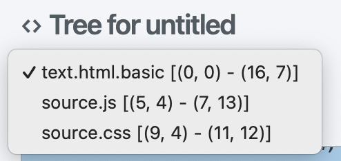
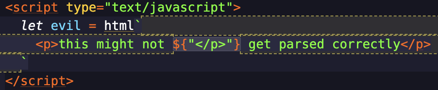

One annoying thing that software developers do is insist on writing in _more than one language at once_. Web developers are espeically obnoxious about this — routinely, for instance, putting CSS inside their HTML, or HTML inside their JavaScript, or CSS inside their HTML inside their JavaScript.

Code editors like Pulsar need to roll with this, so today we’ll talk about how the modern Tree-sitter system handles what we call _injections_.

<!-- more -->

The TextMate grammar system understands injections. In any context, a TextMate grammar can include a subset of its own rules… or an entirely separate grammar.

But Tree-sitter needs something a bit more elaborate. If I’ve got CSS inside a `style` tag in my HTML file, now I’ve got _two different parsers_, each responsible for a different range of code. If I make some changes inside that `style` block, both parsers need to react to it.

Injections cover a wide range of use cases — from the examples above to fenced code blocks in Markdown files to special-purpose injections that recognize things like URLs. Injections allow us to do some powerful and useful things that would be hard to do otherwise — including some things that TextMate injections can’t do at all.

## A mental model for injections

Let’s pretend we have a simple HTML file that looks like this:

```html
<!DOCTYPE html>
<html lang="en" dir="ltr">
	<head>
		<meta charset="utf-8" />
		<title>Sample</title>

		<style>
			body {
				padding: 0;
			}
		</style>

		<script type="text/javascript">
			window.dataLayer = window.dataLayer || [];
			function gtag() {
				dataLayer.push(arguments);
			}
			gtag("js", new Date());
			gtag("config", "G-ABCDEFGHIJ");
		</script>
	</head>
	<body></body>
</html>
```

We haven’t gotten very close to the machinery so far in this series, but I’ve been content to have you model this as a single document with a single Tree-sitter HTML parser responsible for all syntax highlighting. That works fine until we get to the contents of the `style` and `script` elements.

To the Tree-sitter HTML parser, a `style` element looks like this:


You can see that it performs the usual parsing on the start and end tags, but punts on parsing the CSS itself — instead marking it as `raw_text`. This is what it should do! It’s not a CSS parser, after all. It treats the inline `script` element similarly, marking its contents as `raw_text` because it doesn’t understand JavaScript.

To apply syntax highlighting to these areas, we need to bring in parsers that understand these languages.

So our mental model needs to evolve. Instead of one buffer with one parser, we have one buffer with three parsers. We need a name for “a region of the buffer that uses a specific grammar to be understood,” so let’s call it a _language layer_, because that’s what Pulsar calls it under the hood.

### Language layers

Imagine a simpler HTML file that doesn’t have any inline `style` or `script` tags:

```html
<!DOCTYPE html>
<html lang="en" dir="ltr">
	<head>
		<meta charset="utf-8" />
		<title>Sample</title>
	</head>
	<body></body>
</html>
```

Here we’re looking at a buffer with a single language layer at the root. When I type a new keystroke in this buffer, only one Tree-sitter parser has to do any re-parsing work, and only one layer needs to be consulted when re-applying syntax highlighting.

Once I add a `style` block…

```html
<!DOCTYPE html>
<html lang="en" dir="ltr">
	<head>
		<meta charset="utf-8" />
		<title>Sample</title>

		<style>
			body {
				padding: 0;
			}
		</style>
	</head>
	<body></body>
</html>
```

…I trigger the creation of a second language layer. This new layer is a _child_ of the root HTML layer — because the HTML layer is its reason for being, and the CSS layer might go away in the future if the HTML layer changes. The new language layer uses a Tree-sitter CSS parser.

When I add back the `script` block…

```html
<!DOCTYPE html>
<html lang="en" dir="ltr">
	<head>
		<meta charset="utf-8" />
		<title>Sample</title>

		<style>
			body {
				padding: 0;
			}
		</style>

		<script type="text/javascript">
			window.dataLayer = window.dataLayer || [];
			function gtag() {
				dataLayer.push(arguments);
			}
			gtag("js", new Date());
			gtag("config", "G-ABCDEFGHIJ");
		</script>
	</head>
	<body></body>
</html>
```

…I trigger the creation of another language layer: a JavaScript layer that is also a child of the root HTML layer. Now there are _three_ layers that might need to be consulted for syntax highlighting and other tasks.


And it doesn’t stop here! Certain constructs inside of the JavaScript, like regular expressions or tagged template literals, might carry their own injections, in which case new language layers would be created as children of the JavaScript layer. The result is a tree of language layers which cooperate to apply syntax highlighting to our buffer.

This might feel impossibly complex, but it isn’t. It’s just a different approach to what was already being done with TextMate grammars. In a minute I’ll explain how Pulsar manages this complexity.

## How Tree-sitter envisions injections

The Tree-sitter CLI tool performs its own code highlighting, so it needs [its own solution for injections](https://tree-sitter.github.io/tree-sitter/syntax-highlighting#language-injection). It envisions a query file called `injections.scm` that maps certain tree nodes to certain languages. For instance, here’s the HTML parser’s `injections.scm`:

```scm
((script_element
  (raw_text) @injection.content)
 (#set! injection.language "javascript"))

((style_element
  (raw_text) @injection.content)
 (#set! injection.language "css"))
```

These are simple examples, but the website documentation covers more advanced scenarios. For instance, the name of the language might not be hard-coded in the query file; it might be something that you’ll need to determine from the tree itself, like by inspecting a [heredoc string](https://en.wikipedia.org/wiki/Here_document#Perl-influenced)’s tag:

```ruby
list_items.each do |item|
  puts <<~HTML
    <li>#{item.name}</li>
  HTML
end
```

This is a thorough system, and we’ve already shown how query files can solve problems like syntax highlighting and injection hinting. So it can solve our language injection problem, right?

## How Pulsar implements injections

The stuff I just described makes a lot of sense, and it’s possible we’ll do it someday. But here’s how Pulsar does it now:

```js
atom.grammars.addInjectionPoint("text.html.basic", {
	type: "script_element",
	language() {
		return "javascript";
	},
	content(node) {
		return node.child(1);
	},
});

atom.grammars.addInjectionPoint("text.html.basic", {
	type: "style_element",
	language() {
		return "css";
	},
	content(node) {
		return node.child(1);
	},
});
```

This code block is the equivalent of the above query file for HTML injections. It’s got a similar amount of flexibility for selecting a target (e.g., “the second child of a `style_element` node”) and the ability to determine the language name either dynamically or statically. But we’ve done everything else via queries; why do we do injections this way instead?

1. The `addInjectionPoint` API was added by the legacy Tree-sitter implementation. For reasons of continuity, it makes a lot of sense to keep using this API rather than switch to something that’s functionally the same.

2. In fact, there’s one thing that the `addInjectionPoint` API does that a hypothetical `injections.scm` file can’t: it can be used to add injections to Language X _even by someone who doesn’t control the `language-x` bundle_. This makes it far more useful to Pulsar! It means that someone can write their own parser that injects itself into another language, whether in the form of a community package or a few lines in a user’s `init.js`.

To me, it doesn’t make sense to deprecate the `addInjectionPoint` approach when it can do things that a query-based approach can’t. Still, lots of Tree-sitter parsers include that query file, so I imagine that Pulsar will eventually support it _in addition to_ the `addInjectionPoint` API.

### How does it know which language to use?

You might’ve noticed that both the Tree-sitter query file example and our `addInjectionPoint` example refer to the to-be-injected language rather casually — `javascript` and `css`. Internally, grammars tend to refer to one another via their root scope — as in the `text.html.basic` case above. So why not just use the root scope?

Two reasons:

1. In our example, the HTML grammar shouldn’t necessarily hard-code references to the injectable grammars it wants. It makes more abstract sense to describe the language it wants as `javascript` instead of `source.js` — because more than one grammar could theoretically identify as a JavaScript grammar, and because a grammar might want to respond to more than one name. (`js` and `javascript`, `c++` and `cpp`, and so forth.)
2. There are multiple use cases for associating a shorthand token in a buffer file to a language name. I mentioned above how [heredoc strings](https://en.wikipedia.org/wiki/Heredoc) often hint at the language of the string content via the tag. (And as I write this document, I glance at a dozen other examples: fenced code blocks in Markdown.) So it’s useful for us to be able to determine the to-be-injected language dynamically by inspecting the content of the buffer. We need to meet those use cases where they are.

So when an injection wants `javascript`, we need to be able to match it to our `source.js` grammar. That happens via [a property in the grammar definition file](https://github.com/pulsar-edit/pulsar/blob/v1.110.0/packages/language-javascript/grammars/tree-sitter-2-javascript.cson#L6); the grammar itself describes its “short” name.

## Architecture

No matter which approach we use for _describing_ injections, the job of _processing_ injections is roughly the same. All of Pulsar’s Tree-sitter support is written with the understanding that there could be an arbitrary number of grammars that need to be consulted when an edit happens. So the job of parsing a document is divided up into some number of `LanguageLayer` classes arranged hierarchically.

To visualize what we described above, you can once again use [tree-sitter-tools](https://web.pulsar-edit.dev/packages/tree-sitter-tools). Open your favorite HTML document, then run the **Tree Sitter Tools: Open Inspector For Editor** command. You’ll be able to see all of a document’s trees in a drop-down list:



The first item in the list will always be the “root” tree. Other items, if present, represent injections. And because injected languages can have their own injections, this list can grow to arbitrary length.

When the user edits the buffer, even with a single keystroke, we re-parse the document from the root down as follows:

1. The root layer re-parses.
2. When that’s done, Pulsar looks for possible injections by querying for nodes that have been specified in calls to `addInjectionPoint`.
3. If those nodes match the criteria of `addInjectionPoint` _(does the injection describe a language whose name we can match to a grammar? does the node specified by the `content` callback exist?)_, then we try to match them up to the layers that already exist. Layers that can’t be matched to current injection nodes are disposed of, and nodes that can’t be matched to existing layers get new layers created for them.
4. The process starts over for each layer at the next level of depth in the tree until all injections are current and all parsers have re-parsed.

Any keystroke can create a brand new injection _or_ invalidate one that used to exist. If I put the cursor inside of `<style>` and insert an `x`, changing it to `<styxle>`, then the CSS injection would no longer exist, and its corresponding `LanguageLayer` instance would need to be destroyed. If I then undo my change, the parse tree restores the `style_element` node, and a new language layer is created.

Does this feel overwhelming? That’s fair. After all, I’m writing this blog post in a buffer with **32** different language layers across the various code examples, and you’d think that would add up to one hell of a performance penalty on each keystroke. But it doesn’t.

Here are a few reasons why:

1. We don’t revisit every single language layer on every single keystroke because we can determine when a given buffer change _cannot possibly_ affect a given injection. For instance, if I’m editing a section of my HTML file _outside_ of the `style` block, then Pulsar knows it doesn’t have to re-parse the CSS inside of that `style` block yet. It knows that the layer’s parse tree, though _technically_ stale, is not invalid, and will defer re-parsing until an edit happens within its extent of the buffer. (This is true even if those edits cause the `style` block to shift its position in the document!) As a result, lots of buffer changes can short-circuit the exhaustive process I just described.

2. Syntax highlighting _in particular_ is designed for performance, even in injection scenarios. After a buffer’s initial highlighting pass, a given section of code will retain its highlighting indefinitely, even if its position in the buffer shifts as the result of other edits.

   Syntax re-highlighting only happens when a buffer range is specifically invalidated. When an edit happens, Tree-sitter tells us how that edit affects the syntax tree, which in turn tells us which parts of the buffer need to be re-highlighted — and, just as importantly, which parts _don’t_ need to be re-highlighted.

3. Tree-sitter is faster than you think it is. The smaller the edit, the more the parser can reuse its old work, and the faster the re-parse happens.

4. Hardly anything in this process happens synchronously, so buffer operations will _feel_ fast even in the rare case where Tree-sitter needs time to catch up.

### Challenges

The systems we described in the last two installments — [syntax highlighting](https://pulsar-edit.dev/blog/20231013-savetheclocktower-modern-tree-sitter-part-3.html), [code folding, and indentation hinting](https://pulsar-edit.dev/blog/20231031-savetheclocktower-modern-tree-sitter-part-4.html) — are much easier to explain when we don’t have to think about injections. How do we make them work in a multi-language buffer?

Annoyingly, the answer is different for each system. For instance:

- To support code folding in an environment with multiple injected languages, we’d want to ask _each layer_ for its code folds, then combine the results.
- If the user presses <kbd>Return</kbd> and we want to know whether to indent the next line, we should ask _one specific layer_ — the one most qualified to answer that question at the given cursor position.

So sometimes we need to _aggregate_ across layers, but other times we need to _pick a winner_.

Picking a winner is the obvious approach for indentation when you think it through. If I hit <kbd>Return</kbd> when the cursor is in a `script` block, then I’m writing JavaScript, and the JavaScript layer should be the one making indentation decisions. More generally, this means that if more than one layer is active at a given buffer position, we should pick the _deepest_ layer and ask it to decide. (Sometimes this means the deepest layer that _fulfills a certain criterion_ — in this case, the deepest layer that actually defines an indentation query.)

But aggregating is the obvious approach for other scenarios. Tree-sitter grammars get to support Pulsar’s **Editor: Select Smaller Syntax Node** and **Editor: Select Larger Syntax Node** commands (you don’t know you need them in your life until you give them a try!) and those commands should work properly across injection boundaries. So when either command is invoked with the cursor at a given position, we should figure out which nodes contain that point _regardless of which parse tree owns them_. Then we can arrange those nodes from smallest to largest.

<video style="max-width: 100%" autoplay controls muted loop>
	<source src="@source/blog/assets/tree-sitter-select-larger-syntax-node.webm" type="video/webm">
	<source src="@source/blog/assets/tree-sitter-select-larger-syntax-node.mp4" type="video/mp4">
	<p>Your browser doesn’t support HTML video. <a href="@source/blog/assets/tree-sitter-select-larger-syntax-node.mp4">Download this video</a> instead.</p>
</video>

You can see the results here. As I expand the selection by invoking **Select Larger Syntax Node** over and over, the selection starts with nodes in the CSS injection, jumps to nodes in the parent JavaScript injection, then jumps again to nodes in the root HTML injection.

## Strange injection tricks

Mixing languages in a single buffer is messy, so injections need some unusual features in order to deal with that messiness. These features can be used in surprising and powerful ways.

### “Redaction” in injections

One thing that makes Tree-sitter injections more powerful than their TextMate equivalents is their ability to ignore content that isn’t relevant to their jobs. The injection engine “redacts” all content except what it wants a given layer to see.

#### Redacting children

Suppose you had an `html` tagged template literal:

```js
let markup = html` <p>Copyright 2020–2023 John Doe</p> `;
```

Since the tag hints at the language name, Pulsar will give you HTML syntax highlighting for free inside the literal. But that literal is still JavaScript, so what happens if we do this?

```js
let now = new Date();
let markup = html` <p>Copyright 2020–${now.getFullYear()} John Doe</p> `;
```

That `${now.getFullYear()}` part isn’t actually HTML. This example won’t confuse an HTML parser, so it’s not a big deal; but there does exist valid content inside of a template interpolation that _definitely would_ flummox the injection:

```js
let evil = html` <p>this might not ${"</p>"} get parsed correctly</p> `;
```

Ideally, the HTML injection wouldn’t see that interpolation at all. So what if we could hide it?

We can. In fact, we _do_! Here’s what that template string looks like in `tree-sitter-tools`:


Our injection is defined such that we specify the `template_string` node as the content. That means Pulsar will use the buffer range of that node, but will _subtract_ the ranges of any of the node’s children!

We can visualize this with the “Show injection ranges” option in `tree-sitter-tools`:



You can see that the HTML injection layer has two disjoint content ranges on either side of the interpolation. The Tree-sitter HTML parser won’t even know the interpolation is there.

This behavior makes sense as a default, but it can be opted out of with `includeChildren: true` in `addInjectionPoint` if it gets in your way.

#### Redacting via `content` callback

A grammar author has another tool to control what gets redacted: the `content` callback. It’s not limited to returning a single node! It can return an array of nodes, each with its own range; there’s no obligation for those ranges to be adjacent.

Our first HTML injection example earlier applied its own subtle redaction. We specified a `type` of `script_element`, but a `content` callback that returns that element’s second child (the `raw_text` node). So the `type` property tells Pulsar which node to query for _(create an injection for each `script` element)_ but `content` selects the node(s) that will be meaningful to the parser _(omit the `<script>` and `</script>` because those aren’t JavaScript)_.

This flexibility means that it’s possible for _all_ your injections of a certain type to share _one_ language layer. Instead of creating one layer for each of _N_ different buffer ranges, you could create one layer with _N_ disjoint content ranges. The trade-off is that an injection that covers more of the buffer will need to be re-parsed more often in response to buffer changes, but that trade-off might make sense in certain scenarios.

### Macros in Rust/C/C++

C, C++, and Rust allow you to define macros via a preprocessor. Macros are weird for a parser: they can’t be parsed as though they’re valid source code, because they might be fragments of code that aren’t syntactically valid until _after_ preprocessing.

Hence they’re a situation where a language might want to inject itself _into itself_. Consider this code example:

```c
#define circleArea(r) (3.1415*(r)*(r))
```

The `#define` keyword and the `circleArea(r)` preprocessor function signature have to be well-formed, but everything that follows is an anything-goes nightmare for a syntax highlighter. The preprocessor won’t try to parse it or make it make sense; it’ll just make the appropriate substitution throughout the source file and enforce validity later.

For the same reason, the `tree-sitter-c` parser doesn’t attempt to do any parsing of the preprocessor argument — the `(3.1415*(r)*(r))` in our above example. But that argument will _often_ be valid C, so there’s no reason why we shouldn’t take a stab at it:

```js
atom.grammars.addInjectionPoint(`source.c`, {
	type: "preproc_function_def",
	language(node) {
		return "c";
	},
	content(node) {
		return node.lastNamedChild; // the `preproc_arg` node
	},
});
```

This is a low-stakes gambit for us. If the content of the macro _is_ syntactically strange, the parser might get a bit flummoxed, and the resulting highlighting might look a bit weird. But that’s OK! It won’t affect the highlighting of anything _outside of_ the macro content.

### Injecting highlighting for URLs and TODOs

Two built-in packages called `language-todo` and `language-hyperlink` define specialized TextMate grammars. Their purpose is to provide rules that match `TODO:` remarks (in comments) and URLs (in comments and strings), and to inject those rules into certain contexts _regardless of grammar_. This is a lovely feature of TextMate that the Atom developers got for free when implementing TextMate-style grammars back in the day.

The effect is that Pulsar can help you locate TODOs in comments by coloring them differently from the rest of the comment. It can also draw underlines under URLs and even _follow_ a URL when you place your cursor inside of it and invoke the **Link: Open** command.


This works because a TextMate grammar can “push” its injections into any scope _inside any other grammar_, whether that other grammar asks for it or not. For instance, the `language-hyperlink` grammar injects itself into strings, so any language that defines a `string.*` scope will have those rules injected into it.

The legacy Tree-sitter system never had an equivalent feature. I missed it terribly, so I decided to create equivalent Tree-sitter parsers and grammars for these rules. These parsers, when given arbitrary text, can create nodes for things that look like URLs or TODO comments. Once those parsers existed, I could inject them into whichever grammars I wanted:

```js
for (let type of ["template_string", "string_fragment", "comment"]) {
	atom.grammars.addInjectionPoint("source.js", {
		type,
		language: () => {
			return "hyperlink";
		},
		content: (node) => node,
		languageScope: null,
	});
}
```

There’s one new thing here: the `languageScope` option. Typically, you’ll want a grammar’s base scope name to be present inside of an injection; for instance, you’d want a `source.js` scope name to exist inside of an HTML `script` block. But that behavior doesn’t make sense for our use case. We want to add a scope name around a URL when it’s present, but otherwise we want to operate stealthily. Passing `null` to the `languageScope` option lets us bypass the default behavior.

There’s one other thing to address, though. Most comments _won’t_ have URLs in them. Most strings _won’t_ have URLs in them. If I use this code as-is, I’ll be creating one new injection for every string, every line comment, and every block comment in my JavaScript file, whether a URL is present or not. (This unnecessary work, believe it or not, doesn’t create any sluggishness during routine editing, but we should still try to avoid it.)

What should I do? One option would be to do what I described above: create one large injection for the entire document and have it be in charge of all comments and strings in the document. That was my first experiment, but I decided against it because the trade-off wasn’t worth it: incremental re-parses were _slower_ because every buffer change meant that my URL parser had to re-scan the whole buffer.

I’m willing to chalk part of that up to my lack of experience writing Tree-sitter parsers! I’d bet there are things I can do to make those parses less costly. But in the meantime, I applied a Stupid Human Trick™ to get the best of both worlds:

```js
const HYPERLINK_PATTERN = /\bhttps?:/;

for (let type of ["template_string", "string_fragment", "comment"]) {
	atom.grammars.addInjectionPoint("source.js", {
		type,
		language: (node) => {
			return HYPERLINK_PATTERN.test(node.text) ? "hyperlink" : undefined;
		},
		content: (node) => node,
		languageScope: null,
	});
}
```

I can assure you that this feels _incredibly_ silly to do, but it works: we’re pre-screening the content of the node and ignoring those that definitely don’t contain a URL. Returning `undefined` from the `language` callback prevents a layer from being needlessly created. We employ a similar strategy for the `TODO` highlighting.

There’s another thing that feels awkward about this: it’s not as _automatic_ as the previous TextMate solution. Instead of being able to “push” these injections into other grammars, we’re asking those grammars to “pull” our injections into themselves.

In an ideal world, I’d be able to create a generalized injection that applied to _all_ files as easily as in the TextMate grammars. But to create a Tree-sitter injection I’ve got to describe the _name of the node_ I want to inject into. And there aren’t many safe assumptions you can make about Tree-sitter node naming conventions.

The saving grace here is what I mentioned above: the injection API lets you inject things into someone else’s language grammar. So if your favorite community language package doesn’t highlight TODOs and URLs, you can fix that with about six lines of JavaScript in your `init.js`.

### Markdown and front matter

Markdown is how I write most of my prose, including this blog post. And for years it’s been quite popular inside static site generators like [Jekyll](https://jekyllrb.com/) and its successors, but with a wrinkle: those tools support the addition of YAML metadata via [a “front matter” block](https://jekyllrb.com/docs/step-by-step/03-front-matter/) at the start of a Markdown file.

There are two major Markdown parsers for Tree-sitter, both of which are written by third parties rather than by the Tree-sitter organization. [One of them](https://github.com/MDeiml/tree-sitter-markdown) is being actively developed, and boasts built-in support for front matter, but has a number of bugs that are show-stoppers for Pulsar at the moment. [The other one](https://github.com/ikatyang/tree-sitter-markdown) is older, _doesn’t_ support front matter, and doesn’t seem to be actively maintained… but is otherwise _bulletproof_. I’d love to use the newer one for Pulsar, but I can’t justify it until it’s more stable.

So how do we get around the older parser’s lack of support for front matter? By writing our own Tree-sitter parser and using injections:

1. [Write a front matter parser](https://github.com/savetheclocktower/tree-sitter-frontmatter) whose only purpose is to divide a Markdown document into two nodes: (a) front matter and (b) Markdown text.
2. Inject the YAML grammar into the front matter node.
3. Inject the Markdown grammar into the Markdown text node.

In an ideal world, the parser in step 1 would be just an ordinary Tree-sitter parser for Markdown, and we’d need only the single injection for the YAML block. But this’ll tide us over just fine. Documents that don’t have front matter still get parsed by `tree-sitter-frontmatter` and will simply omit the `front_matter` node.

## Next time

I could keep talking about injections, but I can’t affort to test your patience while we still have other topics to visit. Next time we’ll look at what Tree-sitter calls [code navigation systems](https://tree-sitter.github.io/tree-sitter/code-navigation-systems): how to use Tree-sitter to identify functions, classes, and other important parts of your code.
