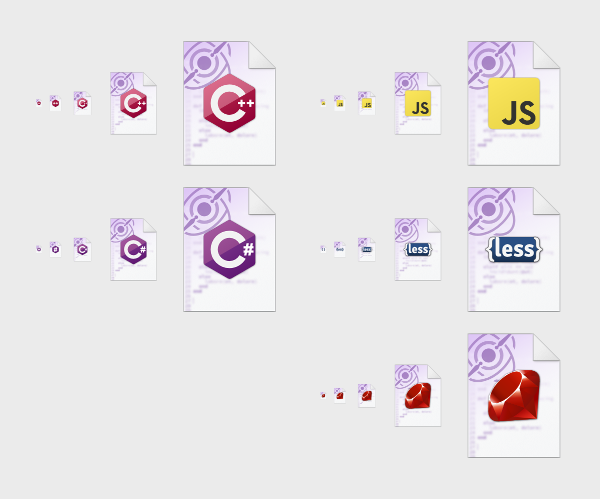

If you have been good this year, you might just find something in your stocking this Christmas. Until then, you can find the Pulsar community update right here!

<!-- more -->

# Welcome to the December Community Update!

Another warm welcome to the Pulsar community update, where we cover new developments and events in the world of Pulsar. This month we have a couple of really significant changes to how Pulsar works internally by creating a couple of new APIs that can be used throughout the application, a new package to help you run code directly within Pulsar and our usual community spotlight to say thank you to those community members contributing to Pulsar's development!

## Update on Electron updates

It has been a while since we have shared an update on the progress of getting Pulsar up to date with its version of Electron. This has been a long-term goal of the project, but not an easy one due to significant changes in the Electron framework. [@maurício szabo] has had a long-running fork of Pulsar that is working on the latest versions of Electron and by all accounts, it works just fine. One recent win has been to get one of Pulsar's core packages, the `github` package, working again.

### Tree-sitter

However, probably our main obstacle is tree-sitter, the library Pulsar uses for a number of languages to perform syntax highlighting, code folding and a number of other useful features that is not only out of date compared to modern tree-sitter but blocking the move to the new version of Electron. The good news is that Pulsar has been shipping with a brand new implementation of tree-sitter for some time now (but disabled by default) and there have been steady updates and improvements to it. If you want to read more about tree-sitter and its implementation, then we have a fantastic [series of blog posts](https://pulsar-edit.dev/tag/tree-sitter/) by [@savetheclocktower] detailing it.

What we plan to do next is enable this modern version of tree-sitter by default, the implementation is pretty mature at this point and it is as good as, if not better than, the original implementation in many languages. Once enabled by default we can iron out any issues we haven't seen as yet with a view to completely removing the old implementation to clear the way to the new Electron version.

### Making it available

We haven't decided on the exact approach yet, but we hope to soon be able to publish "preview" binaries and make them available for download via our website and GitHub. That way, early adopters and people who want to help out with the future of Pulsar can do so easily. The more people we have using it and reporting issues, the faster we can have this migrated into the main version.

Of course, you are always welcome to build it from source using the [latest-electron](https://github.com/pulsar-edit/pulsar/tree/feature/latest-electron-native-superstring) feature branch.

### Package compatibility

One downside to moving to a new version of Electron is that some community packages do use some of these same deprecated features of Electron that have given us so much trouble with some of the core packages. On the surface, this means that we will potentially introduce some breaking changes in Pulsar, causing some of these packages to no longer work - the [Hydrogen](https://web.pulsar-edit.dev/packages/hydrogen) package being a perfect example of this.

However, part of the goal of the Pulsar project was to make sure that the huge number of community packages out there were retained and it is in no way our goal to deliberately break them. To that end, any package authors who find their packages affected by the updated Electron versions are free to reach out to us via any of our [social channels](https://pulsar-edit.dev/community.html). Likewise, if any users are affected by any of these changes and find themselves with an affected package that is no longer maintained by the original author, the same avenues of help and support will be available should you wish to fork and publish the package under your own account.

We also have a plan we mentioned recently, the [Pulsar Cooperative](https://pulsar-edit.dev/blog/20231004-Daeraxa-OctoberUpdate.html#introducing-pulsar-cooperative) initiative, in order to have a community-maintained space for package development without the overhead of full-on ownership.

## PPR website issues

Some people may have noticed we sporadically have some issues with the Pulsar Package Registry website displaying packages correctly. This is rare and tends to resolve itself fairly quickly once the faulty instance is dropped. [@confused-techie] has introduced some additional error logging to try and nail this issue down. The error page has also been updated to include some links for people to report the issues as and when they see them in order to help us capture and resolve this issue.

## Community Spotlight

### Default file icons

Community member [@tthaumaturgist] has produced a whole bunch of amazing new icons that can be used to show that a given file will be opened within Pulsar as well as identifying the type of file at a glance.

They have produced icons for both Windows and macOS, [@confused-techie] is currently working on implementing this within Pulsar for Windows. A huge thank you to them for this wonderful contribution!

***

And that brings this, the final community update of the year, to a close. As always, a big thank you to all of our community members and a special thanks to those who donate to the project and make this possible. We hope to see you again in 2024!

[@maurício szabo]: https://github.com/mauricioszabo
[@confused-techie]: https://github.com/confused-Techie
[@spiker985]: https://github.com/spiker985
[@meadowsys]: https://github.com/Meadowsys
[@kaosine]: https://github.com/kaosine
[@savetheclocktower]: https://github.com/savetheclocktower
[@deedeeg]: https://github.com/DeeDeeG
[@Daeraxa]: https://github.com/Daeraxa

[@tthaumaturgist]: https://github.com/tthaumaturgist
