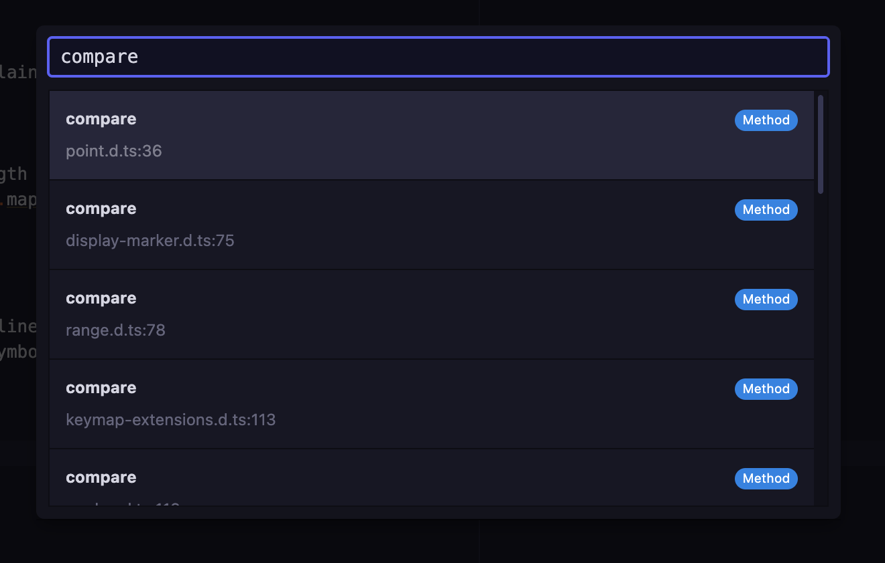
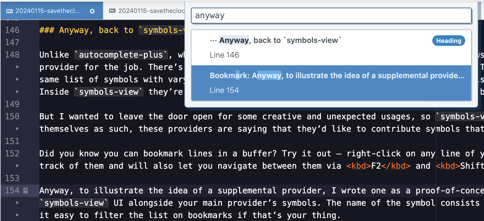

We’ve been telling a series of stories about all the different ways that Tree-sitter can improve the editing experience in Pulsar. Today’s story about `symbols-view` starts a bit slowly, but it’s got a great ending: the addition of a major new feature to Pulsar 1.113.

<!-- more -->

## Background

Back in March, [@mauricioszabo](https://github.com/mauricioszabo/) gave me an assignment:

> Currently, “definitions” are implemented using CTags in `symbols-view`. What do you think about transforming this into a “service”, like `pulsar.definitions` or `editor.definitions`? That way, the tokenizer can “push” definitions into this service, and `symbols-view` can query for the definitions on the current file.

I’ll explain what he’s talking about.

You might already use the [`symbols-view` package](https://github.com/pulsar-edit/symbols-view/blob/master/README.md) to navigate to important parts of your source code files. For instance, if you want to jump to the definition of `render` in a given file, you can

- press <kbd>Ctrl+R</kbd> (or <kbd>Cmd+R</kbd> on macOS),
- start typing `render`, and
- press <kbd>Return</kbd> to accept the first result in the list (or use arrow keys or the mouse to navigate to a different result).

Choosing the `render` symbol in your symbols list will move the editor to the line where `render` is defined.

<video style="max-width: 100%" autoplay controls muted loop>
	<source src="@source/blog/assets/symbols-view-demo.webm" type="video/webm">
	<source src="@source/blog/assets/symbols-view-demo.mp4" type="video/mp4">
	
Your browser doesn’t support HTML video. <a href="@source/blog/assets/symbols-view-demo.mp4">Download this video</a> instead.

</video>

This is a time-saving feature. But how does it work? How does Pulsar know which items to put in the list? How does it know where your `render` method is defined? You might be surprised: it uses an ancient program called `ctags` — specifically a fork called [Exuberant Ctags](https://ctags.sourceforge.net/).

(What Maurício calls “definitions” is what `symbols-view` calls “symbols,” and what `ctags` calls, well, “tags.” For simplicity I’ll use the term “symbol” just to align with what Pulsar calls it.)

`ctags` works well enough that you might never notice its drawbacks, but it’s got _plenty_ of drawbacks. It reads files from disk, so it can return inaccurate results if you use it on a file that has been modified since its last save. For the same reason, it doesn’t work _at all_ on new files that haven’t yet been saved. And it needs [special configuration](https://github.com/pulsar-edit/symbols-view/blob/master/lib/ctags-config) for each language it supports — meaning that, even after you’ve written a Pulsar grammar for your newly-invented Language X, you won’t get any symbol-based navigation unless you modify the `symbols-view` package itself and tell `ctags` how to find your language’s symbols.

I know you’re probably tired of hearing me say “Tree-sitter would be _great_ for this task!” — but [code navigation systems](https://tree-sitter.github.io/tree-sitter/code-navigation-systems) really are in its wheelhouse. The trees we’re already using to highlight code and do other useful tasks can be queried to supply symbols much more easily than via `ctags`. And many parsers even come bundled with a query file that does the work of identifying the symbols we’re interested in.

You might have noticed how GitHub can nowadays give you an outline-like view of a source code file, listing lines where methods are defined. That’s all happening through Tree-sitter. If GitHub can use it for symbol navigation, so can we.

## Refactoring `symbols-view`

But to make that happen, we need to change how `symbols-view` works. All it knows about is `ctags`! Could we rip all that out and replace it with a Tree-sitter solution? Yes, but in the process we’d be abandoning support for any languages that don’t yet have Tree-sitter parsers.

A better approach would be to know about _both_ strategies and pick the best one on the fly. So let’s figure out exactly what Maurício’s request — “transforming \[symbols\] into a ‘service’” — means.

### A crash course in services

In Pulsar, **services** are how packages talk to one another. Suppose I’ve authored `package-b` and it depends on another package called `package-a` that someone else has written. I could reach into `atom.packages` and grab the reference to `package-a`, but this feels weird for a number of reasons. For one, it incorrectly assumes that `package-a` has already been activated. It may get activated _after_ `package-b` — or else it may _never_ get activated because the user has disabled or uninstalled it.

But even if `package-b` were able to find and consume package `package-a` this way, it’d create a tight coupling between the two. That coupling would break if `package-a` renamed itself, or if it changed implementation details that `package-b` was relying on.

So instead of communicating directly, they can invent a service called `foo` and use it to communicate. One package defines itself as a _provider_ of service `foo`, and the other defines itself as a _consumer_ of service `foo`.

During startup, Pulsar will activate each package, notice the match, and arrange an introduction as soon as _both packages_ have been activated. The provider will end up returning an object that the consumer can use however it likes; this object is typically some sort of interface with methods that the consumer can call.

Services thus act as _contracts_ between packages. And they can be versioned, too. If it wants, `package-a` can provide several different versions of the service at once; this leaves the author free to make changes without breaking packages that consume the older version.

### A built-in example

This flexibility makes new things possible. Consider a package like `autocomplete-plus`, the bundled package that provides an autocompletion menu in Pulsar. It doesn’t try to implement the various tactics that can be used to suggest completion candidates; all it does is make the user interface for an autocomplete menu. It then defines an **`autocomplete.provider`** service so that _other_ packages can provide completion suggestions. Packages like `autocomplete-html`, `autocomplete-css`, and others know how to suggest context-specific completions at the cursor, so they feed that data to `autocomplete-plus`.

We like this approach because it gives users an incredible amount of control. For example, if you don’t like the HTML autocompletion suggestions, you can change `autocomplete-html`’s configuration, or even disable it entirely. Or you could write your own alternative to `autocomplete-html`. Or you could even write your own alternative to `autocomplete-plus`! By registering as a _consumer_ of `autocomplete.provider`, your replacement package would be able to communicate with packages like `autocomplete-html` just as easily as `autocomplete-plus` can.

This is the model we need for `symbols-view`. We now have a second approach for generating symbols that can compete favorably with the `ctags` strategy. So let’s reinvent `symbols-view` in the style of `autocomplete-plus` and make it a consumer of a new service we’ll invent named **`symbol.provider`**.

The built-in `ctags` provider can be spun off into a package called `symbol-provider-ctags`, and our new Tree-sitter–based approach can be in a package called `symbol-provider-tree-sitter`. These packages can provide the `symbol.provider` service for `symbols-view` to consume.

### How will it work?

I’ve [talked about why](/blog/20230927-savetheclocktower-modern-tree-sitter-part-2.html) Pulsar chose not to leverage the built-in `highlights.scm` query files that exist for most Tree-sitter parsers: we needed richer information than they could provide. Luckily, that’s not true for other kinds of files! Many parsers also provide `tags.scm` query files, and they’re easy for us to consume as-is.

When a user presses <kbd>Ctrl+R</kbd> / <kbd>Cmd+R</kbd>, we can run a query against the current buffer. Any node that is captured as `@name` in a `tags.scm` file can be represented as a symbol. Often the node will be contained in a larger capture called (for example) `@definition.function`; we can detect that and infer that the text captured by `@name` refers to a function.

The information we get is not only _richer_ than what `ctags` can provide, but also _more accurate_, since we’re querying against the current buffer text. Even if the file hasn’t been saved recently. Even if it hasn’t been saved at all!

Now, we can only do this when the file in question is using a Tree-sitter grammar, so it’s not a universal solution. But we can prefer a Tree-sitter symbol provider where it’s available, and fall back to our `ctags` provider where it isn’t.

### Project symbols

Another thing that `symbols-view` has long supported — theoretically — is _project_-based symbol navigation, allowing you to search for and jump to symbols in other files.

It’s been able to do this because `ctags` can read project-wide symbol metadata — a genuine upside it has over some other approaches. But this feature only works if the user has generated a special file called a “tags file” for their project. Pulsar itself can’t generate this file on its own because it doesn’t know which files it should crawl to find symbols (imagine if it tried to crawl your entire `node_modules` folder!), so the `ctags` strategy requires the user to regenerate that file on a regular basis.

For now, our Tree-sitter symbol provider can only suggest symbols in the current file. If you activate **Toggle Project Symbols** via <kbd>Ctrl+Shift+R</kbd> / <kbd>Cmd+Shift+R</kbd>, it won’t even volunteer for the job. Using Tree-sitter to list the symbols in an open buffer is very fast precisely because the buffer is _open_; we’ve already paid the startup cost of the initial parse. But there’s no way Tree-sitter could parse all of a project’s files in a similar amount of time. If we want project-wide symbol search we’ll have to look elsewhere.

### Go to declaration

“Who cares,” you may think. And I’ll admit I don’t attempt a project-wide symbol search very often. But there’s a related feature I’m pretty sure you’ll like.

`symbols-view` defines a **Go To Declaration** command. It’ll search the project for a symbol matching the word under the cursor. If there’s one result, it’ll get opened automatically; if there’s more than one, it offers up the options in a list for you to choose. And when you’re done, there’s a corresponding **Return From Declaration** command that takes you back to the place you just were.

Dive into a definition with <kbd>Ctrl+Alt+Down</kbd> / <kbd>Cmd+Alt+Down</kbd>, then return to the surface with <kbd>Ctrl+Alt+Up</kbd> / <kbd>Cmd+Alt+Up</kbd>:

<video style="max-width: 100%" autoplay controls muted loop>
	<source src="@source/blog/assets/go-to-declaration-example.webm" type="video/webm">
	<source src="@source/blog/assets/go-to-declaration-example.mp4" type="video/mp4">
	
Your browser doesn’t support HTML video. <a href="@source/blog/assets/go-to-declaration-example.mp4">Download this video</a> instead.

</video>

Here I’ve demonstrated it on a TypeScript type, but it’ll work on functions and classes and other types of things, too.

Did you know this feature existed? I didn’t. It’s been available to you this whole time _if_ you’ve had a tags file to supply project-wide symbols, the way _nobody_ does. But with a refactored `symbols-view`, another candidate for supplying these symbols enters the arena: a _language server_.

### Language servers

I hesitate to mention [language servers](https://en.wikipedia.org/wiki/Language_Server_Protocol) merely in passing, because they’re a deep enough topic to require their own multi-part blog post series. But let me give it a shot.

There are a handful of Pulsar packages named like `ide-x`, where `x` is the name of a language. Several of them were even originally developed by the Atom team. For now I’ll call them **IDE backend packages**.

What these packages have in common is that they all run something called a _language server_ under the hood. A language server is designed to be a brain for a few dozen common features you’d want from your code editor: autocompletion, code linting, refactor support, and the like. A single language server typically knows how to do these tasks for one specific language or framework.

Language servers are exciting because they make it easier for weirdos like us to use editors other than the market leader. Instead of having to write all those features from scratch for, say, TypeScript, an upstart code editor could instead communicate with [typescript-language-server](https://www.npmjs.com/package/typescript-language-server) and write some glue code to wire up the language server’s features to the features of the editor.

The good news is that the language server specification includes several actions that are relevant to `symbols-view`: [`textDocument/documentSymbol`](https://microsoft.github.io/language-server-protocol/specifications/lsp/3.17/specification/#textDocument_documentSymbol) for same-file symbols, [`workspace/symbol`](https://microsoft.github.io/language-server-protocol/specifications/lsp/3.17/specification/#workspace_symbol) for project-wide symbols, and even [`textDocument/definition`](https://microsoft.github.io/language-server-protocol/specifications/lsp/3.17/specification/#textDocument_definition) for finding where a symbol is defined. Some IDE backend packages already have “brains” capable of doing these tasks!

But here’s the bad news: since the `symbol.provider` service has only just been invented, those IDE backend packages need updates before they can be used for symbol navigation.

I’ve started to do a bit of that work. Inspired by `ide-typescript` — but mainly starting fresh — I’ve been working on a package currently called [`pulsar-ide-typescript-alpha`](https://web.pulsar-edit.dev/packages/pulsar-ide-typescript-alpha) that aims to be its drop-in replacement. It should be able to do everything that `ide-typescript` can already do, but it will also be able to offer project-wide symbol search and go-to-declaration functionality.

And it might take a few version bumps on dependencies, but most other IDE backend packages can also be updated to take advantage of these features.

### Anyway, back to `symbols-view`

Unlike `autocomplete-plus`, which aggregates suggestions from multiple providers and shows all of them to the user, `symbols-view` is mainly interested in choosing _the_ best provider for the job. There’s little point in aggregating across a language server _and_ Tree-sitter _and_ `ctags`, since they’re largely going to be offering the same list of symbols with varying degrees of richness, and you’d be pretty annoyed if Pulsar offered you three different list entries for the same function. Inside `symbols-view` they’re called “exclusive” providers because only one of them will be picked for the job.

But I wanted to leave the door open for some creative and unexpected usages, so `symbols-view` also has a concept of “supplemental” providers. A provider that marks itself as supplemental is saying it’d like to contribute symbols that would probably not already be in an exclusive provider’s list. You may be wondering what kinds of symbols would fit the bill, so let me give you an example…

Did you know you can bookmark lines in a buffer? Try it out: right-click on any line of your editor and select **Toggle Bookmark**. The built-in `bookmarks` package keeps track of them and will also let you navigate between them via <kbd>F2</kbd> and <kbd>Shift+F2</kbd>.

Anyway, to illustrate the idea of a supplemental provider, I wrote one: [`symbol-provider-bookmarks`](https://web.pulsar-edit.dev/packages/symbol-provider-bookmarks) will turn each of your bookmarks into a symbol, then display them in the `symbols-view` UI alongside your main provider’s symbols, using the text of the bookmarked line as the symbol name.

This one’s not bundled with Pulsar, so [grab it from the package registry](https://web.pulsar-edit.dev/packages/symbol-provider-bookmarks) if it sounds interesting.

## Shipping now

I’ve had most of this article written for months, but I decided to wait to publish it until we could show this stuff off. That time is now.

Pulsar 1.113 makes two major changes that will vastly improve the quality of the symbol searching you might already be accustomed to:

1. The new version of `symbols-view` is now in place. It will offer you `ctags`-based symbols in grammars that don’t use Tree-sitter, but it will prefer Tree-sitter–supplied symbols in most grammars. If you truly don’t like change, you can disable the `symbol-provider-tree-sitter` package and just rely on `symbol-provider-ctags`, or else you can configure `symbols-view` to prefer some providers over others.

   But I’m betting you’ll want to keep using the symbols provided by Tree-sitter, because…

2. As you may have heard, modern Tree-sitter grammars are now the default! The system that we shipped in experimental fashion back in Pulsar 1.106 is now ready for prime time. For now, you can opt back into legacy Tree-sitter with the new `core.useLegacyTreeSitter` setting — but not for long, because the legacy system will be dropped when we’re finally able to migrate to a newer version of Electron.

Because common languages like JavaScript, Python, Ruby, and many others have full-featured modern Tree-sitter grammars, they will also be using our new Tree-sitter symbol provider for <kbd>Ctrl+R</kbd> / <kbd>Cmd+R</kbd>. That means the symbol results should be better _across the board_ — more accurate and more comprehensive. (If it seems worse, please [file a bug](https://github.com/pulsar-edit/pulsar/issues).)

How does this actually improve the `symbols-view` experience? Let’s see what our original example looks like with a Tree-sitter symbol provider:

<video style="max-width: 100%" autoplay controls muted loop>
	<source src="@source/blog/assets/symbols-view-tree-sitter-demo.webm" type="video/webm">
	<source src="@source/blog/assets/symbols-view-tree-sitter-demo.mp4" type="video/mp4">
	
Your browser doesn’t support HTML video. <a href="@source/blog/assets/symbols-view-tree-sitter-demo.mp4">Download this video</a> instead.

</video>

The richness of the metadata we get from these sources has allowed us to enhance the `symbols-view` UI, too! You’ll be shown the “kind” of thing that a symbol is — class, function, constant, et cetera. In many cases, these kinds will be illustrated with icons. Visit the package settings page for `symbols-view` to explore the possibilities.

And there are even a few _killer_ new features. Open a symbols list on a JSON file and marvel at the entries you see:

The _entire key path_ is now the name of the symbol! The same sorts of query and predicate tricks we’ve seen in previous installments in this series can be used for awesome features like this. [The `symbol-provider-tree-sitter` README](https://github.com/pulsar-edit/pulsar/blob/master/packages/symbol-provider-tree-sitter/README.md#advanced-features) has more details.

And it’s early days for [`pulsar-ide-typescript-alpha`](https://web.pulsar-edit.dev/packages/pulsar-ide-typescript-alpha), but I’ve been using it for a few months as a symbol provider (and a go-to-declaration provider!) on TypeScript _and_ JavaScript projects. Feel free to give it a shot yourself. (And if you’re interested in bringing one of the other `ide-x` packages into the year 2024, please do broach the topic on [GitHub Discussions](https://github.com/orgs/pulsar-edit/discussions), [Discord](https://discord.gg/7aEbB9dGRT), or [one of our other communities](https://pulsar-edit.dev/community.html).)

## Conclusion

After overhauling Pulsar’s [syntax highlighting](/blog/20231013-savetheclocktower-modern-tree-sitter-part-3.html), [indentation, code folding](/blog/20231031-savetheclocktower-modern-tree-sitter-part-4.html), and [language injections](/blog/20231110-savetheclocktower-modern-tree-sitter-part-5.html), we’ve found _yet another_ way that Tree-sitter can improve our existing editor experience. But in this case, there’s an _even better_ improvement just around the corner: IDE backend packages and language servers. I’ll be sure to go into more detail on the Pulsar IDE experience in future posts.

Integrating Tree-sitter has been a difficult project. I started working on it in earnest in February of 2023; it shipped in June behind an experimental flag; and it’s finally the default grammar type in January of 2024.

Our Tree-sitter series is nearing an end, but there’s one more thing to cover: the challenges. Could it have been easier? Can Tree-sitter overcome its pain points and drawbacks? We’ll talk about it next time.
