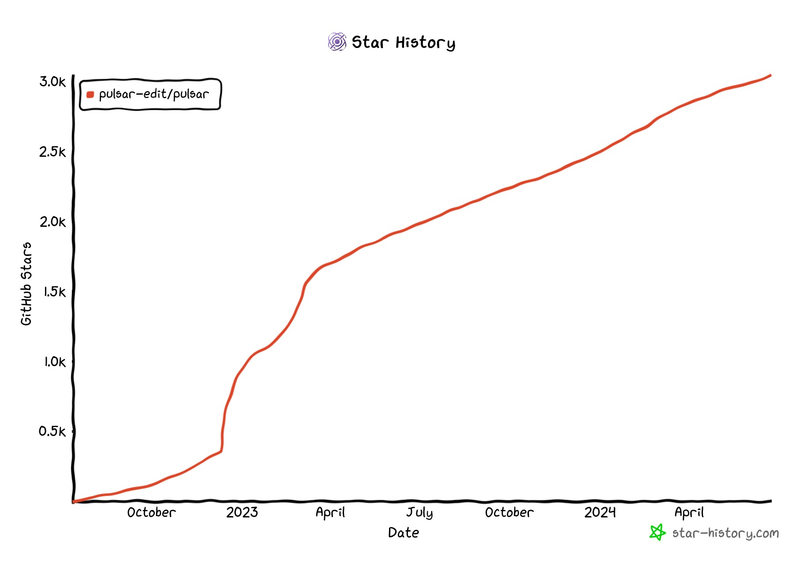
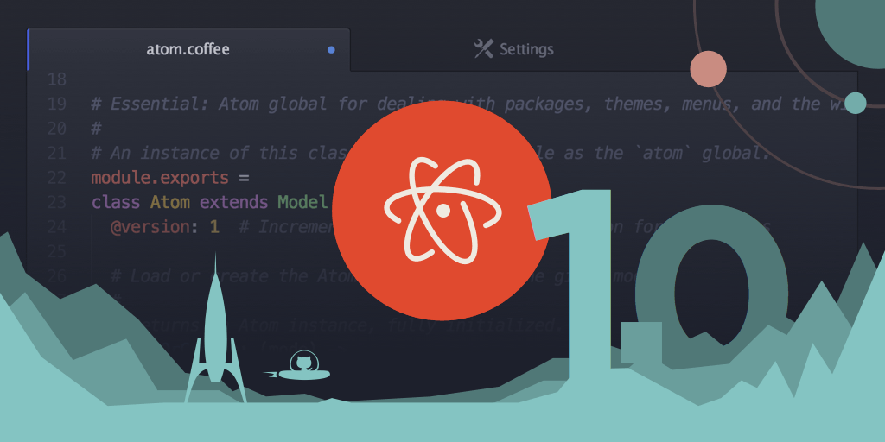
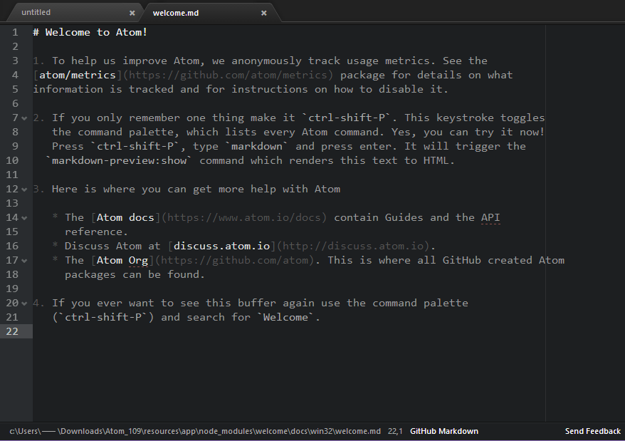
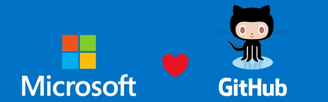
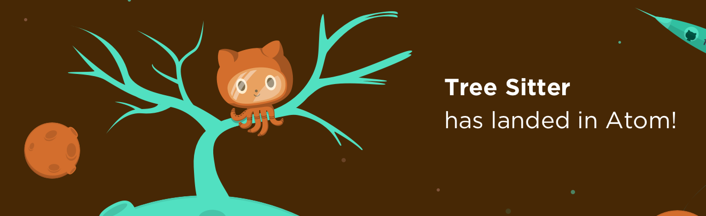
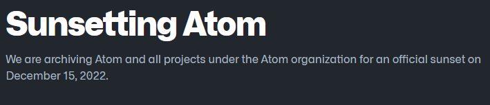
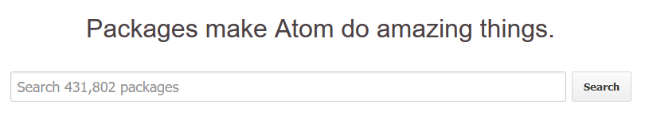
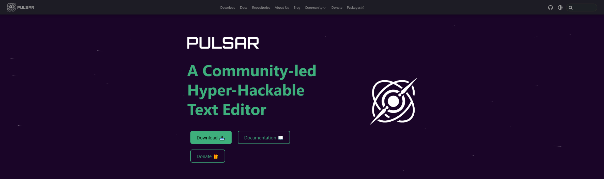

In just under a year since we hit [2k stars](https://pulsar-edit.dev/blog/20230610-Daeraxa-2kStars.html) we have hit another milestone, this time of 3k stars on GitHub! (Yes, this celebration post is late; we actually hit it on 06/06).

We figured this might be a good chance to write a blog post going into the history of Pulsar and Atom (without which Pulsar would obviously not even exist!), covering some major events along the way.

<!-- more -->

Before we go into that, we would like to take the opportunity to yet again thank our wonderful community and everyone who contributes to Pulsar. By that, we don't just mean those contributing to the codebase, but everyone: those people creating issues on GitHub, people taking part in conversations on our various social platforms, our generous financial donors, and anyone who has helped promote Pulsar by any means — upvoting, boosting toots, social media comments, and, of course, starring on GitHub.

We know that the stars aren't everything, but they do give us a good idea about our general growth and community awareness. You can see from the graph that we are still on a steady upward trajectory, and we don't have plans on slowing down just yet!

## History of Pulsar

### Creation of Atom

Atom started out in 2008 being developed by GitHub's co-founder and then-CEO Chris Wanstrath; but it wasn't until 2014, with the addition of Corey Johnson and Nathan Sobo to the team, that things really got moving and we first saw the beta being released to the public.

You can view the [original announcement](https://web.archive.org/web/20140302005920/http://blog.atom.io/2014/02/26/introducing-atom.html) and how it portrayed GitHub’s vision for Atom: a no-compromise mix of usability and hackability. They had realised there was a gap in the market between the former (Sublime Text, TextMate) and the latter (Vim, Emacs) and wanted to bridge that gap.

Initially the editor wasn't fully open source, but there were a bunch of libraries and packages that were. If you want to see what these early versions of Atom were like, they are still available in the original [atom/atom releases](https://github.com/atom/atom/releases). Back then, it looked a little different to what we are used to today, but you can still use that original theme in Pulsar! (Settings > Themes > UI Theme > Atom Dark/Light).

Of course, the thing that made Atom _Atom_ was its underlying framework, something developed specifically for Atom called _Atom Shell_, a cross-platform framework designed to allow web technologies to be used in a desktop application. You might know it better these days as [Electron](https://www.electronjs.org/blog/electron/). So yes, if you weren't aware before, this means that the Atom editor is directly responsible for the framework that allows a whole host of popular applications to exist: Discord, VS Code, Joplin, Slack, and [far, far, more](https://www.electronjs.org/apps).

Later in 2014, [GitHub announced](https://web.archive.org/web/20140506163807/http://blog.atom.io/2014/05/06/atom-is-now-open-source.html) that Atom would become fully open-sourced under the MIT license and invited the community to actively contribute to its development; it is under this license that Pulsar is still developed.

In 2015, [Atom 1.0](https://github.com/atom/atom/releases/tag/v1.0.0) was released and came with a [fantastic retro-futurisitic launch video](https://www.youtube.com/watch?v=Y7aEiVwBAdk) to accompany it.

<iframe width="560" height="315" src="https://www.youtube.com/watch?v=Y7aEiVwBAdk" title="YouTube video player" frameborder="0" allow="accelerometer; autoplay; clipboard-write; encrypted-media; gyroscope; picture-in-picture" allowfullscreen></iframe>

### Microsoft acquires GitHub

In June of 2018, Microsoft announced that they were [acquiring GitHub](https://blogs.microsoft.com/blog/2018/06/04/microsoft-github-empowering-developers/). This immediately prompted concerns from the Atom user base because Microsoft had released their own Electron-based text editor back in 2015: Visual Studio Code. The concern was that Microsoft would shut down development of Atom in favor of their own product as the two products were competing in very similar areas.

To help alleviate the Atom community's worries, Microsoft's newly instated GitHub CEO, Nat Friedman, said in a [Reddit AMA](https://www.reddit.com/r/AMA/comments/8pc8mf/im_nat_friedman_future_ceo_of_github_ama/e0a2b2e/?context=1) that Atom was safe and development would continue on both products.

### Tree-sitter lands in Atom

You may have read our [series of blog posts](https://pulsar-edit.dev/tag/tree-sitter/) from [@savetheclocktower] and [@maurício szabo] that detail the huge amount of work that has been going on to upgrade our Tree-sitter implementation.  

This all goes back to 2018, when [Max Brunsfeld announced](https://github.blog/2018-10-31-atoms-new-parsing-system/) that Atom 1.32 would be shipping with a brand-new parsing system that promised to be better at understanding your code and making it easier to write: [Tree-sitter](https://tree-sitter.github.io/tree-sitter/).  

Just as Atom Shell was created for Atom and was then widely used elsewhere, Tree-sitter now sits at the heart of a number of other projects: [Helix](https://github.com/helix-editor/helix), [Zed](https://zed.dev/), [Neovim](https://neovim.io/), and even Github's own [Linguist](https://github.com/github-linguist/linguist) library.

### GitHub sunsets Atom

Despite the reassurances that Atom and VS Code could coexist under Microsoft’s umbrella, it became clear that interest in Atom development was decreasing, new features weren't forthcoming, and issues were being left unresolved. The Atom.io blog page saw its last update in 2019 with the announcement of Atom 1.39; most releases after that featured fixes and updates, but little in the way of exciting new features.

The old Atom forum was shut down (but is still browsable via the [Wayback Machine](https://web.archive.org/web/20210622052601/https://discuss.atom.io/) and moved to the then-new [GitHub Discussions](https://github.com/atom/atom/discussions)… but there was little interaction from the original developers. The original package website languished and didn't have its "Featured" or "Trending" packages updated for a long time.

Finally, on the 8th of June, 2022, GitHub made an announcement that Atom would be [sunset](https://github.blog/2022-06-08-sunsetting-atom/) in favour of VS Code and gave six months’ warning before the various services that make up the Atom ecosystem would go offline forever. The software itself and its source code would, of course, still be available via the archived repository; but the website, Flight Manual, package backend, and Teletype service would no longer be available.

### Atom Community

As soon as the news hit, there was a flurry of activity. Some were looking for direct replacements for Atom; others were looking for active forks or continuations of the project. [Atom Community](https://atom-community.github.io/) was the logical place for these discussions. This was a community that had taken on the maintenance of a bunch of Atom packages (originally for the abandoned Facebook [Nuclide](https://nuclide.io/) project to turn Atom into an IDE) and had since assumed stewardship of other packages from the original Atom maintainers.

At this time, the Atom Community Discord server was rather active with discussions about what could be done. Could the community keep Atom alive? Could they take ownership of any of the original repos? Would a community project be allowed to use the original name? However, it became clear there was somewhat of a split in the goals of the group. Some wanted to take Atom and radically change it, upgrade it and take it into the future — bringing it into the state it might have been in had development not slowed to a crawl. Others wanted to be a little more conservative: keep the Atom they knew and loved and make sure it was kept up-to-date with patches and fixes.

With no real ability to reconcile these creative differences, and with such different goals in mind, it was clear that the projects needed to go their separate ways. The group that wanted to see Atom evolve more aggressively split off and started work on what would, after a [community poll](https://discord.com/channels/737254137690980372/803109315480125514/990452760661098557), be called **Pulsar**. The name was chosen to represent the rebirth of the project — something that almost died, but that still emits pulses of energy and can feed on energy pumped into it.

A new Discord server was created for the new community as well as a GitHub organisation in order to organise for the work to come.

### Salvage operations begin

One of the biggest problems was that time was not on our side. In under six months we would be losing the original Atom.io website and, most importantly, the package registry. The Atom.io package backend was not an open source project like the rest of the editor but was essential in keeping a list of published packages for Atom and serving them to its inbuilt package manager, APM.

This is where [@confused-techie] was particularly instrumental in not only the creation of [a tool](https://github.com/confused-Techie/AtomPackagesArchive) to archive the entire package backend from Atom.io but the _from-scratch re-implementation_ of the backend service needed to serve the reborn editor.

This was no mean feat and is too much to go into in this blog post, but, thankfully, this is all detailed in our [first-ever blog post](https://pulsar-edit.dev/blog/20221127-confused-Techie-SunsetMisadventureBackend.html) Give it a read if you really want to understand the full scale of the undertaking.

There were other challenges, too — like what to do about packages with [no license](https://pulsar-edit.dev/blog/20230319-confused-Techie-HowLicenseNoneDeletedPackages.html), or custom licenses designed specifically for Atom.io. We also had to deal with a huge amount of spam from Vietnamese and Thai gambling sites that had been hammering the original backend. Out of around 405,000 packages, roughly 12,000 packages were archived for reasons of license incompatibility, license absence, or spam.

### Modernizing the editor

We had some big tasks ahead of us; changes needed to be made, and work needed to start to get some traction on the project. We desperately wanted to keep the community alive, but with the announcement of the sunset, people were fleeing the sinking ship. We had to get the project up and running to show that Pulsar was a serious continuation of the project and not just a fork on GitHub with a renamed README.

- **Building from source:** Atom had a rather complicated (and now rather fragile) way of [bootstrapping](https://atom-flight-manual-archive.github.io/hacking-atom/sections/hacking-on-atom-core/#cloning-and-bootstrapping) itself for development. One of the first tasks was to simplify this to a process that we think is much more robust and much more familiar to those using Node and Electron. This makes it much easier to get involved with Pulsar development.

- **Rebranding:** We had to start removing Atom references and replacing them with references to Pulsar. We also had to decide when _not_ to remove Atom references; for instance, `atom` is used extensively within the APIs and changing that would’ve broken a lot of code with little justification. We also had to decide on a new logo for the project and add it to the application along with updates to GitHub and social media site links.

- **Decaffeination:** - Atom was originally written mostly in [CoffeeScript](https://coffeescript.org/), a rather useful language in its time that compiles to JavaScript. Though it made sense at the time, it was harder to justify over the years as CoffeeScript did not keep up with the evolving syntax of JavaScript; and its ubiquity in the codebase was a significant barrier to new contributors. The original Atom team had started this process of “decaffeination” — conversion of CoffeeScript to ordinary JavaScript — but over time we were able to achieve the goal of _complete_ decaffeination in Pulsar by version 1.109 and in PPM by version 1.110.

- **CI and builds:** - We needed an automated platform to build our binaries and run tests. For this, we went with [CirrusCI](https://cirrus-ci.org/), which had a more than generous free tier; it reliably built our binaries and ran our tests for over a year. We have since had to [move away](https://pulsar-edit.dev/blog/20230903-confused-Techie-pulsars-ci.html) from CirrusCI for most tasks, but we still use it for building some of our binaries.

- **Versioning:** - Atom's last stable release (at the time) was Atom 1.60. We wanted to stay with [Semantic Versioning](https://semver.org/) as Atom had — but what should our first full release be?

  It’s common for Atom packages to specify `atom` in their `package.json`’s `engines` field — and to specify a version range of `>=1.0 <2.0`. We could reset the counter back to 1.0 — but many packages specified a newer version of Atom than 1.0 because they relied on features that were added in a certain Atom version. We could move to 2.0 — but we would’ve broken lots of packages that had specified a *maximum* compatible version. We could continue the numbering from Atom — but this seemed like we weren't getting a clean break as a new project.

  In the end, we decided to jump from 1.60 to 1.100 — a number that would give us a clean start whilst avoiding the issues with package version limits.

- **Electron updates:** - This was, and still is, one of our biggest goals for Pulsar. When development slowed in Atom, it caused the Electron version to get further and further behind. At the time Pulsar was born, it was using Electron 11, which went EOL in the second half of 2021. We managed to get Pulsar onto Electron 12 rather quickly, but to go further required some rather extensive changes that are still being worked on. Read our blog post on [The Quest for Electron LTS](https://pulsar-edit.dev/blog/20240124-mauricioszabo-the-quest-for-electron-lts.html) for more information on the topic.

With this work either complete or underway, we made our first tagged release of Pulsar — [1.100.0](https://github.com/pulsar-edit/pulsar/releases/tag/v1.100.0-beta) — on the same day that Atom was finally sunset: the 15th of December 2022.

### Website, documentation, and socials

As mentioned, we needed to demonstrate that Pulsar was a serious project in order to make sure people looking for Atom alternatives (and those looking for VS Code or other text editor alternatives) knew we were around and were a legitimate option. To this end, we created the [pulsar-edit.dev](https://pulsar-edit.dev) website to serve as a hub for our download links, news and blog posts, documentation, and links to social platforms for people to get help.

We archived a copy of the original Atom Flight Manual as well as creating an edited, rebranded, and updated version of it to work with our website framework to make sure that we had documentation we could link to and maintain. We made a download page for people to find the latest releases easily, rather than relying purely on a GitHub release link. This was a substantial amount of work that was split between multiple people and took a while to complete.

Could we have *technically* got by without this? Probably, but we wanted to show the whole community that we were deadly serious about our commitment to the project and wanted to make sure that it came across this way to anyone who stumbled upon us.

We also wanted to make sure that we were catering to as many avenues of social communication as possible. We already had the Discord server, but we didn't have anywhere that catered to longer-form or asynchronous communication.

To this end, we set up a [subreddit](https://www.reddit.com/r/pulsaredit/), [forum](https://github.com/orgs/pulsar-edit/discussions) and [Mastodon account](https://fosstodon.org/@pulsaredit) to try to cover as many avenues as possible to make sure people could use their preferred method of contact (where reasonable). We later added [Lemmy](https://lemmy.ml/c/pulsaredit) as a Reddit-style option for those who like the format but would rather not use Reddit.

## The future

That just about covers the past, and we hope this fills in some of the blanks in the project timeline up until this point. We also hope it clarifies where the project came from and how it came to be. We do not want to forget the past — Pulsar wouldn't exist without Atom — but neither do we want to be tied to it forever; we are forging our own path for the project. We need to both recognise our past and be confident in our future direction.

For details of what has been going on in the project since we got going in earnest, you can refer to our collection of [blog posts] (https://pulsar-edit.dev/blog/).

But what can we expect for the future?

The work to get us onto modern versions of the underlying technologies of Pulsar will continue. This is still progressing nicely, and we hope to have a big announcement some time in the future when this has been achieved.

We feel we have somewhat outgrown our current website. We needed to get things up and running as quickly as possible, which meant using a rather opinionated framework and theme. This was fantastic at the time and was exactly what we needed; it allowed us to have a fully functional website with minimum fuss, but it is relatively inflexible, and making changes and updates has been difficult. We are therefore planning to slowly introduce replacements for the various areas of the website, starting with our documentation, which will be far less opinionated and much more flexible.

We realise that more attention needs to be given to our [Pulsar Cooperative](https://github.com/pulsar-cooperative/) initiative. There are still plenty of packages out there in need of love that no single person is necessarily comfortable maintaining alone. We want to make sure everyone knows this is an option to get changes made to the packages they can't do without. We achieved some initial success with this, but we have since let things fall to the wayside a little, so we just need to give some love to this area of the project, make sure it is promoted and its objectives and processes are clear.

Of course, if there is anything you think is missing from the project, then make sure to let us know via our various [social channels](https://pulsar-edit.dev/community.html). We want to hear what we could be doing better, and we are always looking for more people to get directly involved.

***

We have already said it above, but thank you so much to everyone in our wonderful community. This project simply wouldn't be where it is without your involvement and contribution, no matter how small. You really do make this project not only possible but rewarding. It is always a wonderful feeling to see Pulsar recommended on various social platforms and blogs, and it makes it all worth it.

So thanks again, and here's to the next 1,000 stars!

- The Pulsar Team

[@savetheclocktower]: https://github.com/savetheclocktower
[@maurício szabo]: https://github.com/mauricioszabo
[@confused-techie]: https://github.com/confused-Techie
